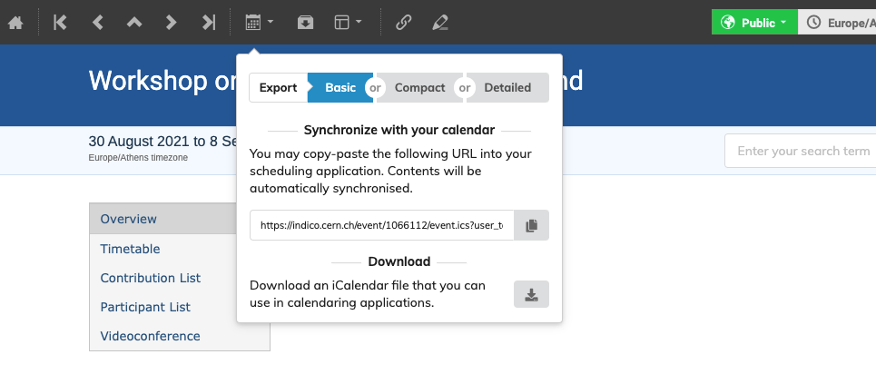
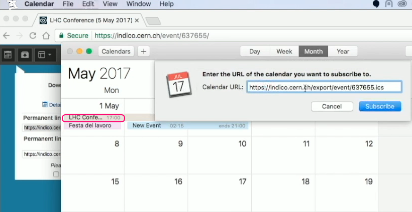

# Import into Calendaring Tools

On the event display view, click on the calendar icon at the top left of the page.

On the window that appears, you can download a file that you can open with your calendaring tools.

Alternatively, you have two URLs, the first for the information that is only publicly available, and the second one that contains protected information as well.
Copy one of the URLs to import into your calendaring tool.

In your preferred calendaring tool, enter the new calendar subscription by pasting the URL you just copied and clicking on _Subscribe_.

Importing the event in your calendaring tools using this URL, as opposed to the downloadable file, will make sure that any subsequent changes to your event will be periodically updated.

