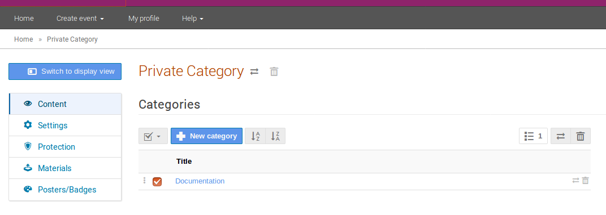

# Managing a Category

You can move sub-categories or events by selecting them using the checkboxes and clicking on the horizontal arrows on your right. You are then prompted to choose the new location of the events/sub-categories.

To delete a sub-category and anything it contains or an event, select it and click on the bin. Categories cannot be deleted if they are not empty.
