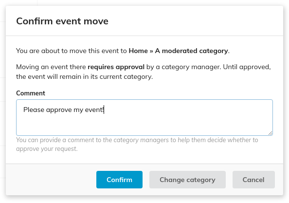
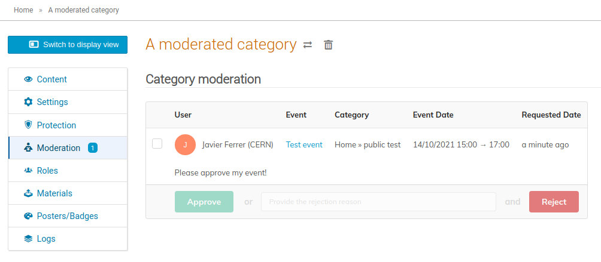

# Moderation

*Moderation* is a workflow which allows event managers to request moving an event to a category. Only once a category manager approves this request, the event is actually moved.

To enable Moderation, open the *Protection* tab and set *Event creation mode* to *Moderated unless authorized*. When you enable moderation in a category, only users with creation rights will be able to create events in it. Other users who want to move events into that category require approval from the category managers.

Category moderators are presented with a list of requests and they can approve or reject them one by one or in batches, optionally providing a reason for rejection.

