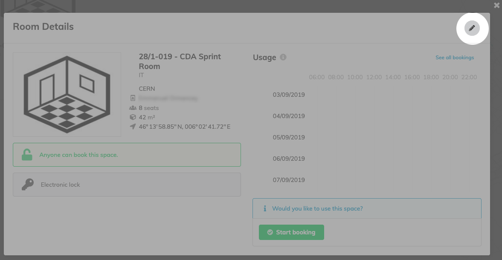
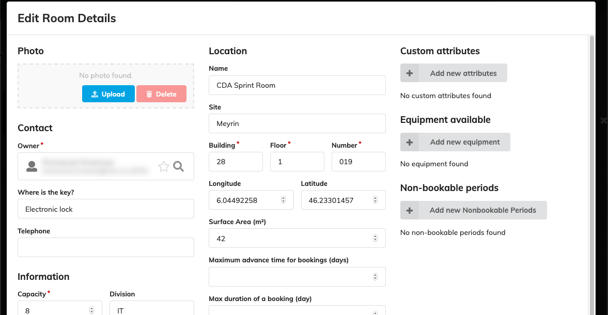
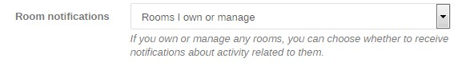

!!! info "Target audience"
    This documentation is meant for users managing Indico rooms (DSMs and DSAs in particular).

## Accessing

You will be able to edit any room to which you have management access by clicking on the "pencil" icon in the "Room
Details" dialog.

You should then see a modification form which will allow you to edit the room's fields.

### Who has access?

The following persons have management access to a CERN room on Indico:

 * The **room owner** (obtained from CERN Locations);
 * Users listed on the *AIS roles* app as **DSM and DSA**;
 * The members of any **e-group with management privileges**;

E-groups may be given management privileges from within Indico, while individual users are directly synchronized from
CERN Locations ("room owner") and *AIS roles* (DSM/DSA).

## Room synchronization

All rooms and spaces that exist in the organization are stored in the Foundation DB and managed using the *CERN Locations* tool.
CERN Locations is a separate [web application](https://locations.cern.ch/locations) which is used to catalogue
rooms and other spaces in the Organization. Indico will automatically import rooms created on it, as long as they follow
certain rules.

!!! tip
    Only rooms of types `CNF` and `REU` (conference and meeting rooms) are automatically retrieved and included in
    Indico's room list, and only as long as their configuration is correctly set (e.g. make sure they have an owner!).

Synchronization happens **once every hour**, so changes made in CERN Locations may take up to 1h to be propagated to
Indico.

### Modification rules

The following room attributes are **always** synchronized with CERN Locations and thus are **not meant to be updated in
Indico**:

 * **Name** (incl. **Building**, **Floor** and **Number** as well as the **"familiar" name**);
 * **Site**;
 * **Owner**;
 * **"Where is the key?"**
 * **Capacity**;
 * **Surface area**;
 * **Telephone**;
 * **Division**;
 * **Comments**;
 * **Geographical Coordinates**.

!!! warning
    Indico will not allow you to add/remove any users/groups with management rights over the room either.

## E-mail notifications

As an owner or manager of a room, you will receive e-mail notifications about it by default. You can choose to not
receive them through the *Room notifications* option in your [Indico profile](https://indico.cern.ch/user/preferences/).

