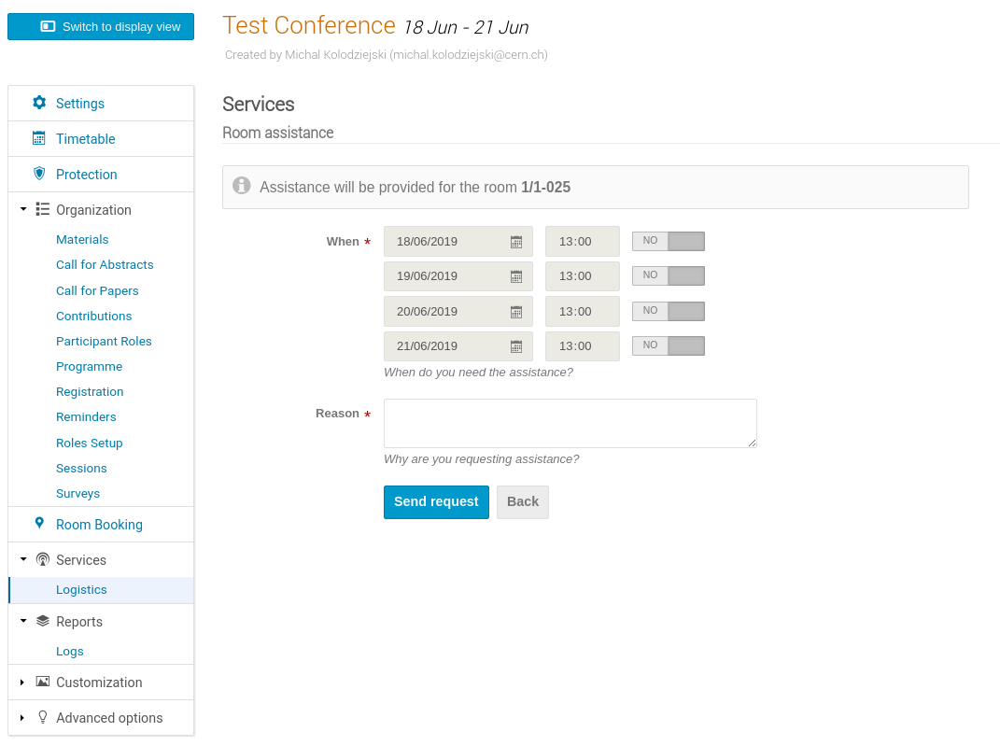

# Room startup assistance

To avoid problems while setting up a conference room for an upcoming event, you might want to request assistance
from the room startup support team.

!!! warning
    In previous releases, users would request assistance per booking. But this has changed and requests are now
    created per event.

Provided that the event location points to a room for which the team offers support, you can proceed and create
an assistance request. In order to do that, go to the management area of the event and then navigate to
_Services_ -> _Logistics_ -> _Room assistance_ using the side menu.

Using the form below you can precisely specify when and why you would like someone from the support team to show up at the
event location to help you set up the room.

!!! warning
    Assistance can only be requested for the days of the event.

