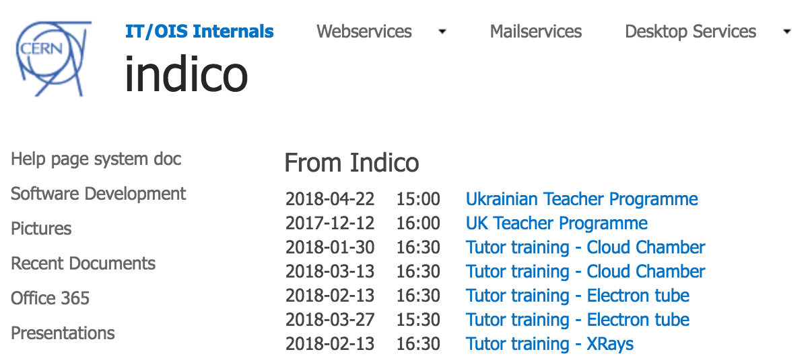

# Creating Sharepoint web part

If you maintain a Sharepoint website, it is very easy to create a web part 
inside it exposing the forthcoming events from an Indico category.
First off, you need to create an _XML web part_. After that, you should
add a link, like the one below, to the _XML link_ part.

```
https://indico.cern.ch/export/categ/5883.xml?from=today&to=tomorrow
```
(for more, see [HTTP Export API](https://docs.getindico.io/en/latest/http_api/))

After that, simply add the link below in the _XSL link_:

```
https://indico.cern.ch/export.xsl
```

The example result:


