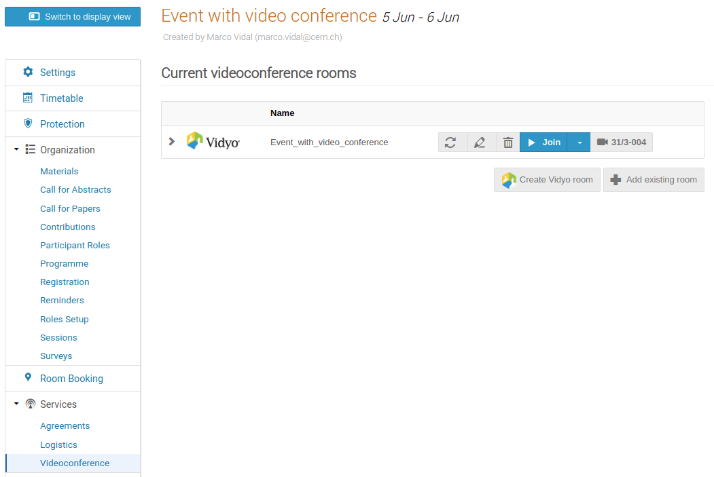
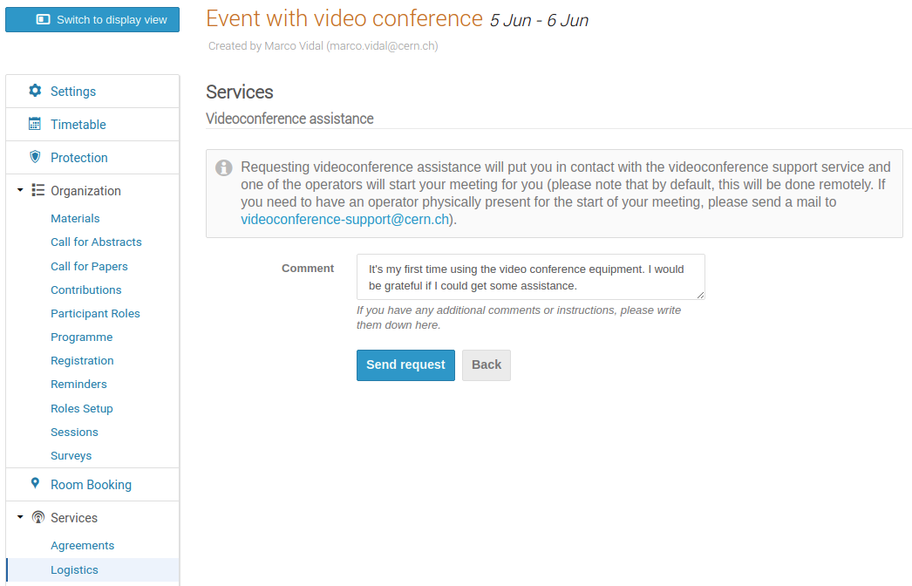

# Videoconference Assistance

Requesting videoconference assistance will put you in contact with the videoconference support service and one of the
operators will start your meeting for you.

!!! warning
    Please note that by default, this will be done remotely. If you need to have an operator physically present for the
    start of your meeting, please send a mail to
    [videoconference-support@cern.ch](mailto:videoconference-support@cern.ch).

Videoconference assistance is requested per event and it can be useful if you are not familiar with the videoconference
equipment in the physical meeting room.

In order to be able to request videoconference assistance for an event the following is required:

- The event must have as location a room with videoconference capabilities.
- The event must have a videoconference (Vidyo) room attached.

When creating an event from scratch, its location can be set in the dialog that is displayed. For an event that has been
already created it can be updated in the _Settings_ page in the event management area.

To create a videoconference room you should go to the _Videoconference_ page under _Services_ and create a Vidyo room.

After this you are ready to request videoconference assistance. In order to do that you should go to the _Logistics_
page under _Services_ and click on the _Videoconference assistance_ box.

Then, you will be able to send the assistance request and add some comments if you consider it convenient.

