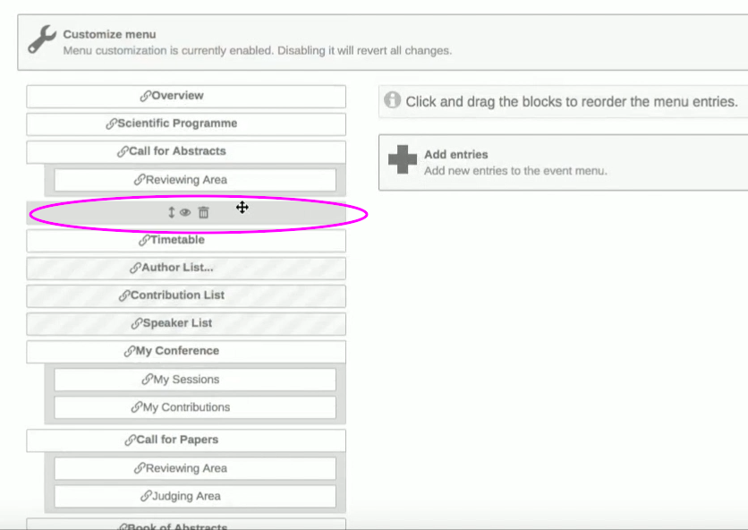

# Customizing the Conference Menu

You can customise the appearance of your indico menus, by clicking on _Menu_, under the tab _Customisation_, while on management mode.

Select _Yes_ on the right so that you can start customising the menus on your pages.

Click on the **eye** icon to show or stop showing a particular
block. Then you can drag and drop the block to change their order and you can click on the pencil to edit the titles of the menu blocks.

To add another block to your Menus you can click on _Add an entry_, then either on _Add link_, or _Add page_.
For example, you can add a page entitled “Accommodation” where you will show some photos of hotels, where participants of the conference can stay, and so on.
You can also select the option _Add spacer_ that will separate two blocks.

Click on _Switch to display view_ to see the changes to your menu that you just made.

