# Editing

This short video explains the editing process in Indico:

<iframe width="576" height="360" frameborder="0" src="https://cds.cern.ch/video/2728257?showTitle=true" allowfullscreen></iframe>

Read about this process in detail below.

> **Note:** To enable the upload of conference materials and proceedings, at least one of the following modules must be enabled: Editing or Paper peer reviewing.

### Editing management

From the event management page, click _Editing_ on the left banner, under _Workflows_.

Click _Enable module_ to enable the editing module.

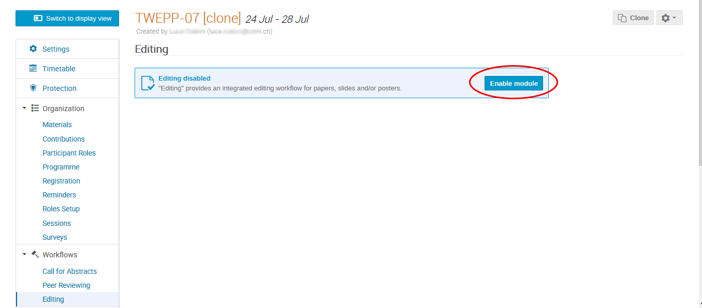

Click on the toggle switch to configure which editable types are enabled, you can choose any of the following options: Paper, Slides and Poster.

Click on _Save_ to apply the changes.

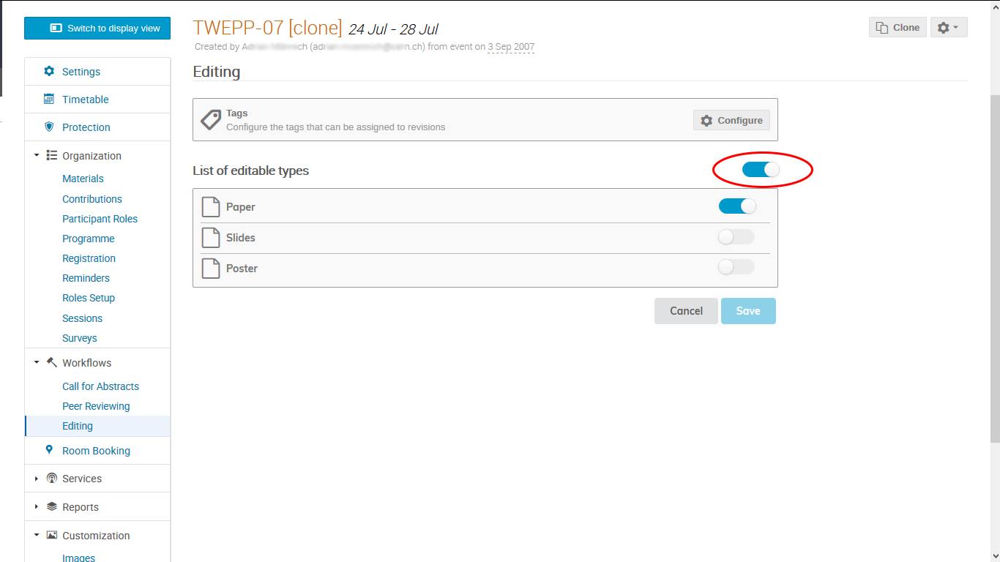

Click on _Manage_ to access the editing management page.

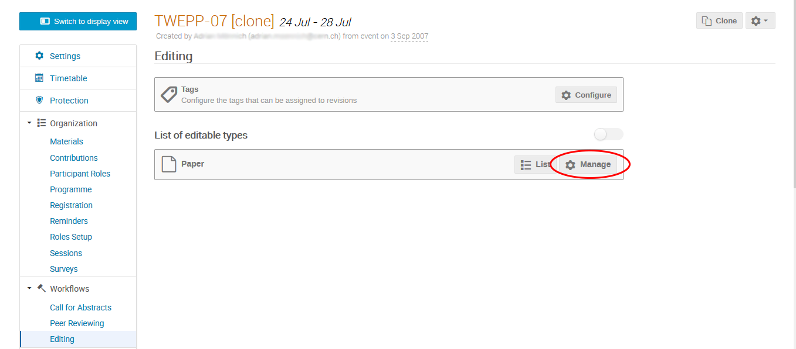

Click on the _Start now_ button on the right of _Submission is not open_ **(1)** to open the submission for new editables.

Click on the _Start now_ button on the right of _Editing is not open_ **(2)** to allow editors review the submissions.

Click on _Manage teams_ **(3)** to open teams management and add or cancel editors.

Click on _List_ **(4)** to open the list of submission and assign each of them to an editor.

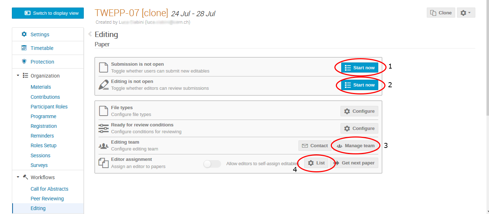

### As a submitter
#### If Paper Peer Reviewing has been activated

Once the paper is accepted, from the display view, as a submitter, click on the _Paper Peer Reviewing_ sectionof the page and click on _Submit for editing_:

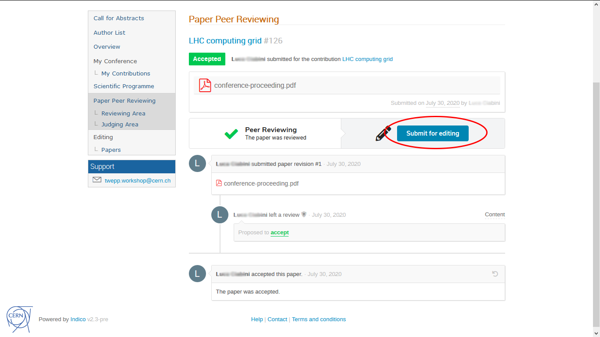

Upload the file you want to submit and then click on _Submit_.

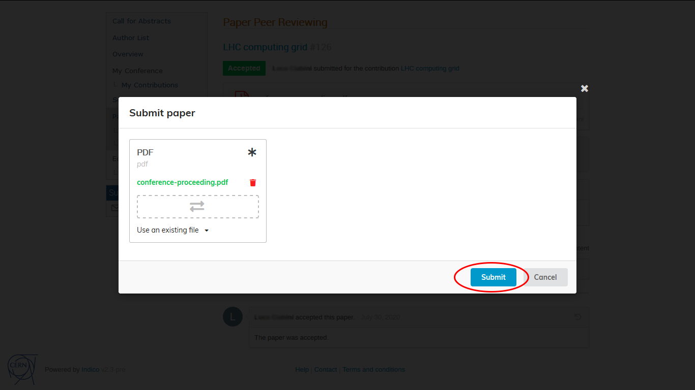

If the editor asks for a correction you will be able to submit a new file via the _editing_ section.
Select the new file and then click on _Submit new revision_

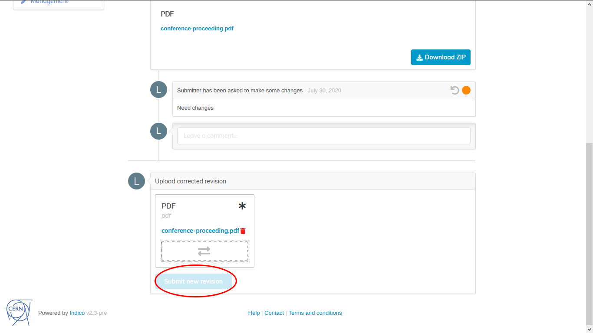

If you want to upload slides and/or poster(s) for editing in addition, follow the process in the next section.

#### If Paper Peer Review has not been activated

From the event display view, as a submitter, click on _My Contributions_ under _My Conference_.
See the list of your contributions and click on the contribution for which you want to upload material.

Under the _Editing_ section click on the drop-down menu and select the material you want to upload.

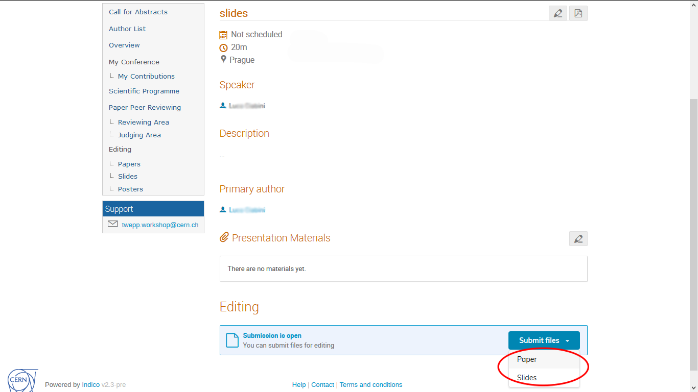

Upload the files and then click the _Submit_ button.

### As an editor

From the event display view, as an editor, click on the editing area.
See the list of materials you are an editor of.
Click on the paper you want to edit to access it.

Under the submission you will see a textbox to add a comment and a drop-down menù where you can choose an action:

- _Accept_ to accept the editable
- _Reject_ to reject the editable
- _Make changes_ to upload a modified document
- _Request changes_ to ask for a change

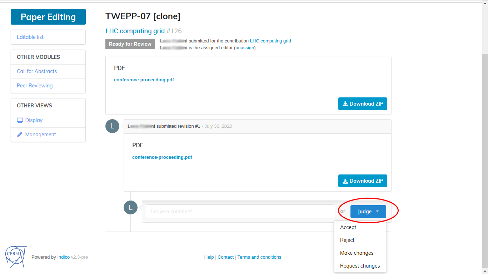

Click on _Confirm_ to apply the action.

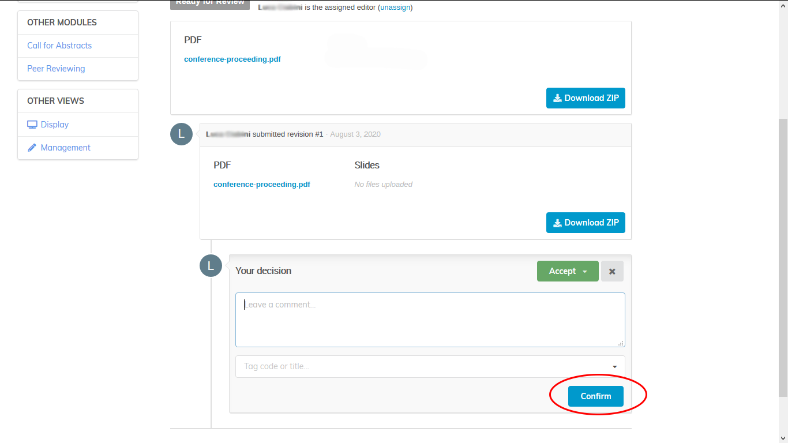

## Using Paper Peer Reviewing with Editing

The graph shows that you can do Peer Reviewing or Editing or both, in which case Peer Reviewing takes place first.  Once it is complete, then the paper can be submitted for the Editing stage. Nevertheless, you may enable only one of them.

The Editing module is intended to enhance and extend the complex process of change management in a certain material, we recommend its usage for larger events where reviewing is a critical step. If both of them are enabled, the base philosophy is that Peer Reviewing concerns about the content and scientific correctness of the paper, whereas Editing intends to focus on the material layout, review comments or even editor suggestions.

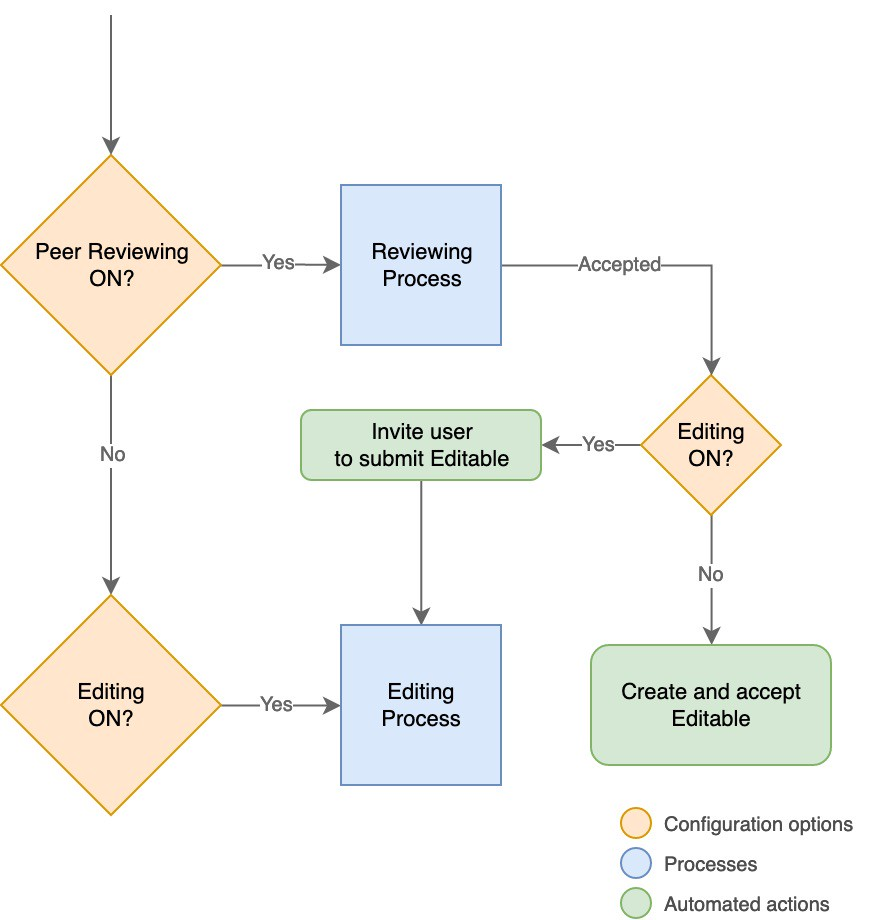
