# Editing

### Introduction

This short video explains the Editing process in Indico:

<iframe width="576" height="360" frameborder="0" src="https://cds.cern.ch/video/2728257?showTitle=true" allowfullscreen></iframe>

Just like the Peer Reviewing module, the Editing module provides a paper workflow whereby authors submit papers which are subsequently reviewed and/or corrected.
Specifically, the module allows you to

- submit papers, posters and slides for a review,
- set up an editing team and assign editors to editables,
- review and judge editables and
- publish accepted materials.

!!! note
    If you're not sure which module to use, check the [introduction](./introduction.md) for a higher level description of the Peer Reviewing and Editing modules.

Here is a flowchart showing an overview of the editing workflow:

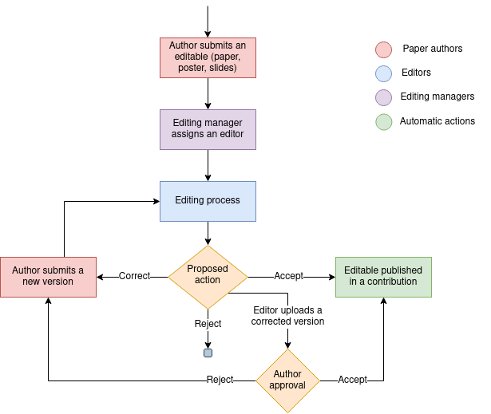

The following sections explain how to use the Editing module from the point of view of organizers, authors and paper reviewers.

### Configuring the Editing module as a manager/organizer

#### Enabling the module

In order to start using the Editing module, you need to first enable it.
From the event management page, click on the _Editing_ tab in the left menu, under _Workflows_.
Click _Enable module_ to enable the Editing module.

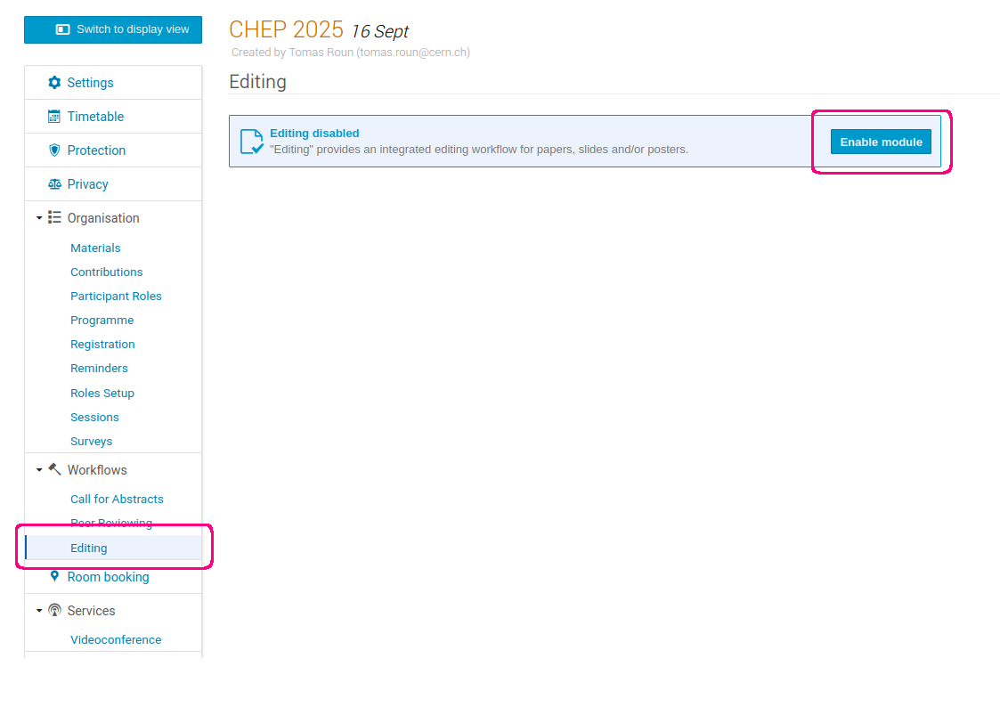

The module can be disabled at any time from the _Features_ tab under _Advanced options_.

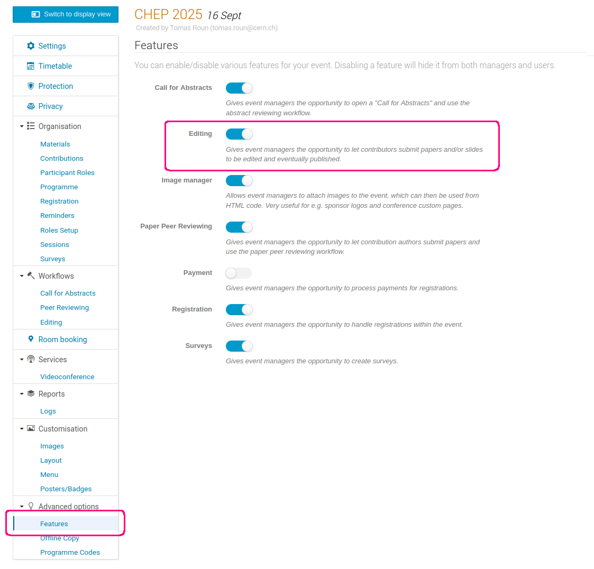

Once the module is enabled, you will see new tabs appear in the conference's menu when switching
to the display area.

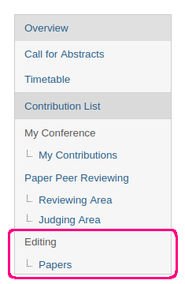

#### Granting access to the Editing module

By default, event managers can access the management area of the Editing module.
In addition, anyone with the _Editing manager_ permission can also manage the module.
This permission can be set on the _Protection_ page of the event.

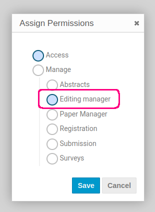

#### Configuring editable types

As previously alluded to, unlike the Peer Reviewing module, the Editing module allows you to submit not just papers but also slides and posters.
These are referred to as editable types and you can configure which ones are enabled. Authors will not be able to submit a material for that particular type unless it is enabled.
By the default, only the _paper_ editable type is enabled.

To enable more editable types, first navigate to the _Editing_ page in the management area. Then, click on _Toggle editables types_:

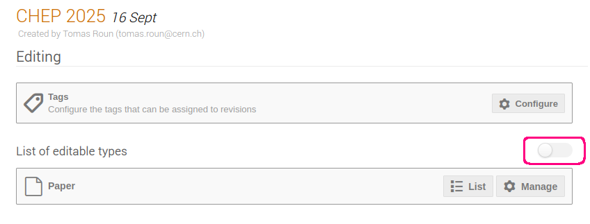

Now you can toggle the individual editable types:

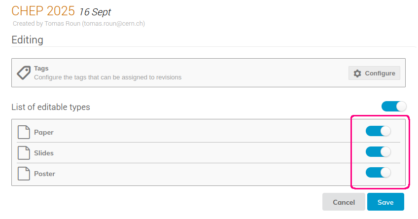

Once finished, click _Save_ to save the changes.

Note that the settings for each editable type are separate. You can open them by clicking on _Manage_ next to the editable type you want to edit:

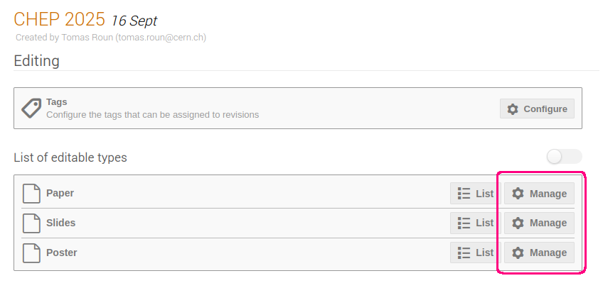

You will see this settings page:

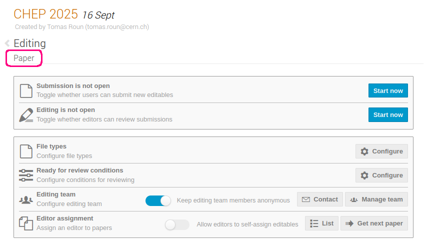

The subtitle tells you what editable type you are currently editing. In this case, we are editing settings for papers.

In the following sections, we explain the various settings found on this page. 

#### Managing file types

From the same settings menu above, you can manage allowed file types by clicking on _Configure_ next to _File types_:

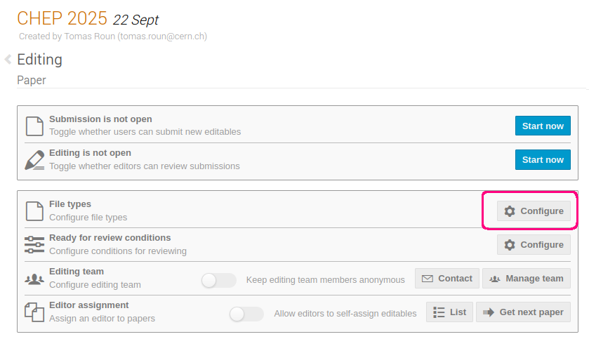

By default, PDF is added as the default file type.

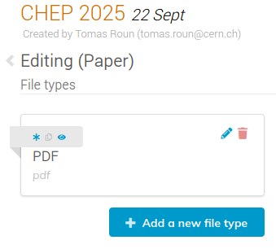

This means that by default, authors can only submit PDF files for this editable type. If you want to allow other file types, such as a CSV file with additional data, click on _Add new a file type_ at the bottom of the page.

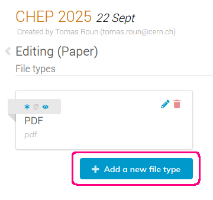

This opens a dialog window with several options:

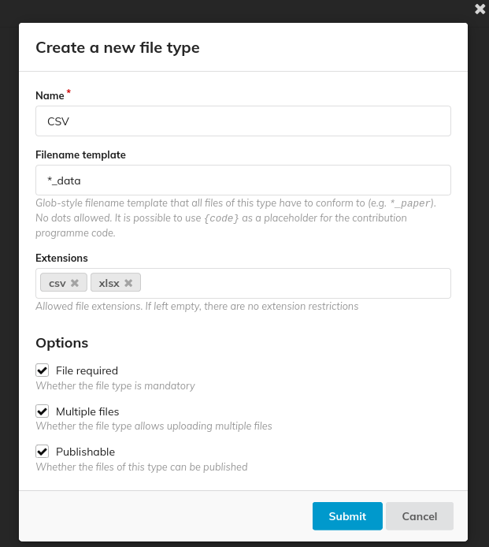

The _Filename template_ is an optional file name pattern. You can use this to make sure that the submitted file names conform to the specified pattern. For example, all CSV files ending
with '\_data' and all PDF files ending with '\_paper'. You can also optionally specify allowed file extensions, e.g. '.csv' for CSV files and '.pdf' for PDF files. At the bottom of the dialog, there are a few more options you can toggle.

- File required - whether this file is required when submitting the given editable (paper, poster or slides).
- Multiple files - allows uploading multiple files for the same editable type, such as multiple PDF files.
- Publishable - controls whether the files of this type should be published in the corresponding contribution. This is useful in case some files should only be visible to the editors.

Once done, click on _Submit_ to create a new file type. If you need to edit the file type later, you can do so by clicking on the edit icon next to it. Deleting a file type is possible as long as no file of that type has been uploaded and the file is not referenced in reviewing conditions (explained in the following section).

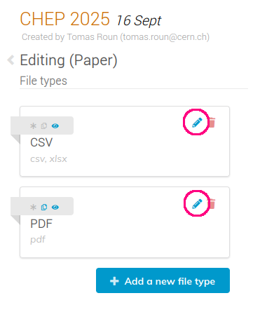

#### Setting up 'Ready for review' conditions

In case you have complex submission requirements based on file types, you can benefit from setting up reviewing conditions. An example where reviewing conditions are useful would be a conference requiring authors to submit either a PDF or a Word document with a CSV file attached. Since you want the authors to be able to choose between PDF and Word, you cannot make either of the file types required. However, you still want that at least one of them submitted. Reviewing conditions allow you to easily express complex conditions such as this one.

Note that these conditions will not outright prevent authors from uploading incomplete submissions, but the timeline of the editable will display a warning when the reviewing conditions are not met.

To add a new condition, click on _Configure_ next to _Ready for review conditions_ in the management page of your chosen editable type.

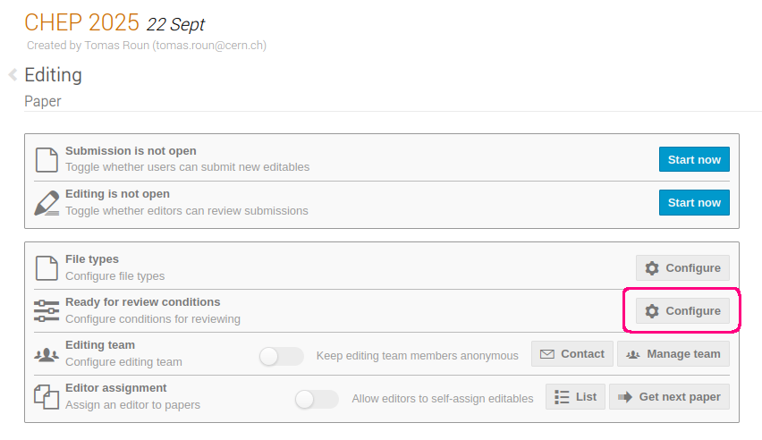

On the next page, click on _Create new file type condition_.

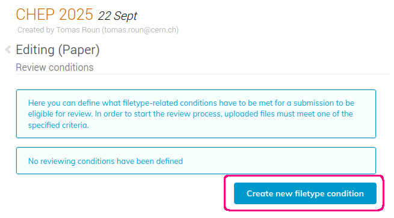

Use the dropdown to select the file types you have defined previously. If you select more than one file type, the chosen combination of file types will be required.
For example, if you select PDF and CSV, authors will be required to upload at least one file of each type.

When you've selected your first condition, click on the tick icon to confirm:

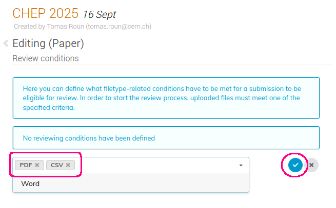

To finish our example, we will add a second condition for a Word document and a CSV file. The final state should look like this:

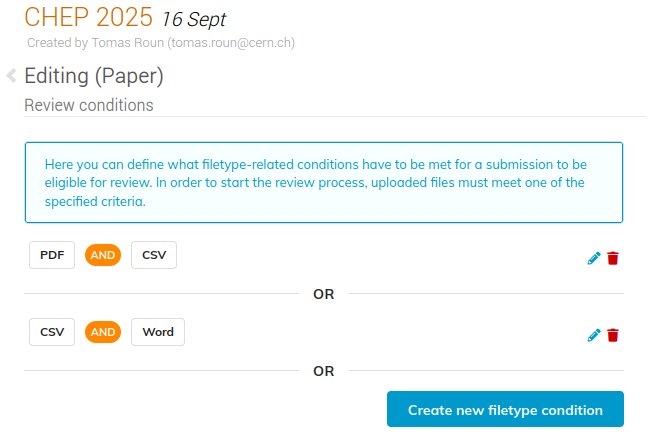

These example conditions mean that authors must submit a CSV file together with either a PDF or a Word document.
If the conditions are not met, authors and editors alike will see a warning on the timeline of the editable:

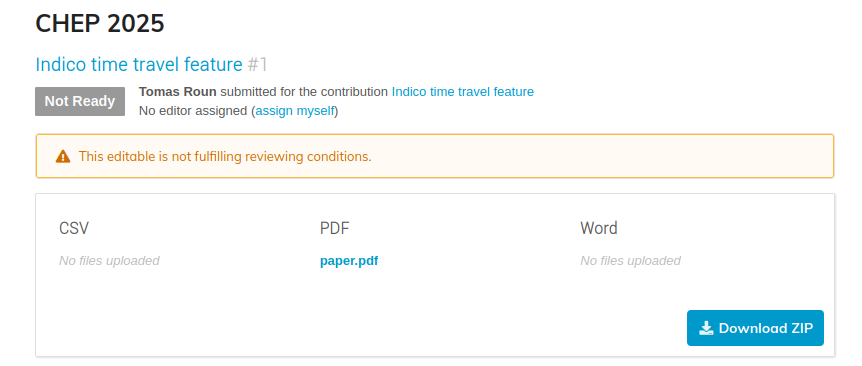

#### Setting up the editing team

The Editing module lets you set up the editing team which is similar to the reviewing teams in the Peer Reviewing module.
Only users added to the editing team can view the list of editables and review them.
Unlike the Peer Reviewing module, there is no separation between reviewers and judges - editors have the role of both.

The editing team is separate for each editable type, meaning that for example the paper editing team is different from the editing team for posters or slides.

To add an editor to the editing team, click on _Manage team_ next to _Editing team_:

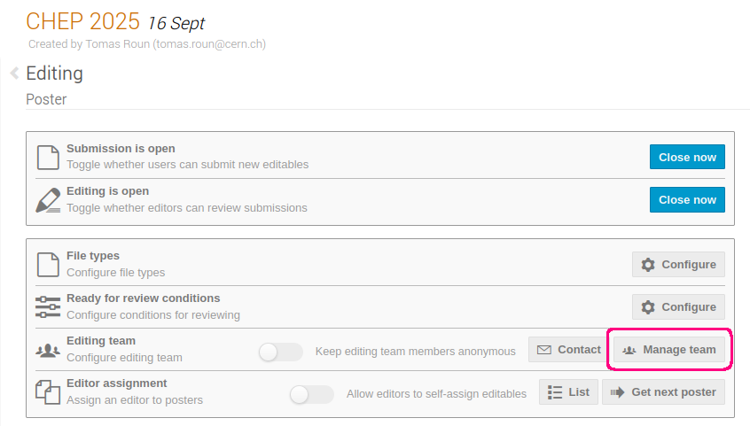

Here, add your users and click _Submit_. You can use the same procedure to remove editors as well.

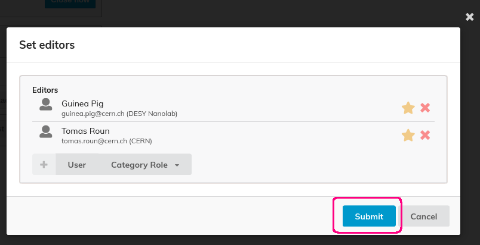

Having set up the editing team, you can now easily contact all editors via email should you need to. Click on _Contact_,
select the recipients and click on _Send emails_ which will open a dialog window where you can type the email.

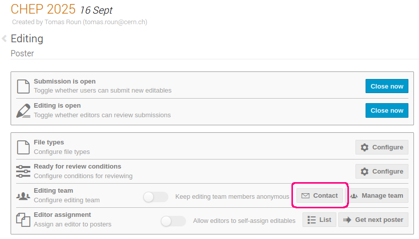

The Editing module also lets you keep the editors private.
This means that authors will not be able to see the identity of the editors reviewing and commenting on their submissions.

Editors are visible by default. To hide them, toggle _Keep editing team members anonymous_ next to _Editing team_:

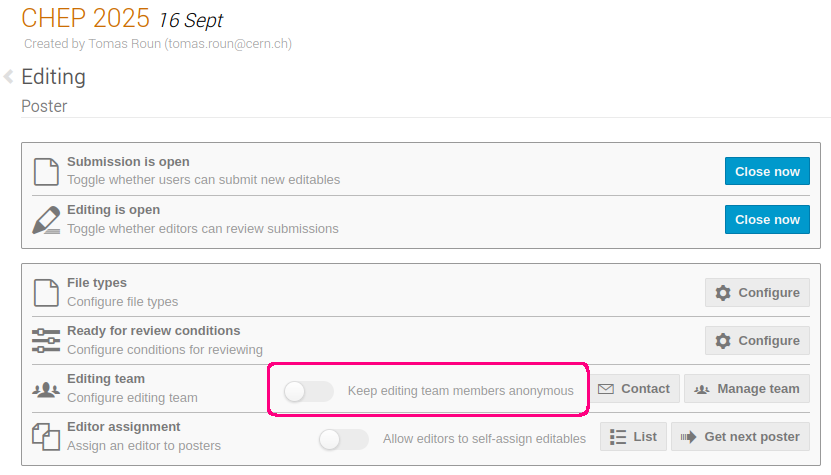

#### Opening submission & editing

Once you are done configuring the Editing module, you can open submissions and editing. This will allow authors to submit editables and reviewers to review them.
Each editable type (papers, slides and posters) can be opened and closed independently. Both submissions and reviewing can be opened from the management page of the editable type by clicking on _Start now_:

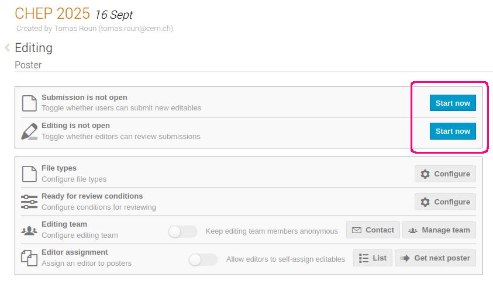

To close submissions or reviewing, simply click on _Close now_.

#### Assigning editables

Editors may only review editables that have been assigned to them by editing managers. To assign editors to papers, click on _List_ in the _Editor assignment_ section of your chosen editable type.

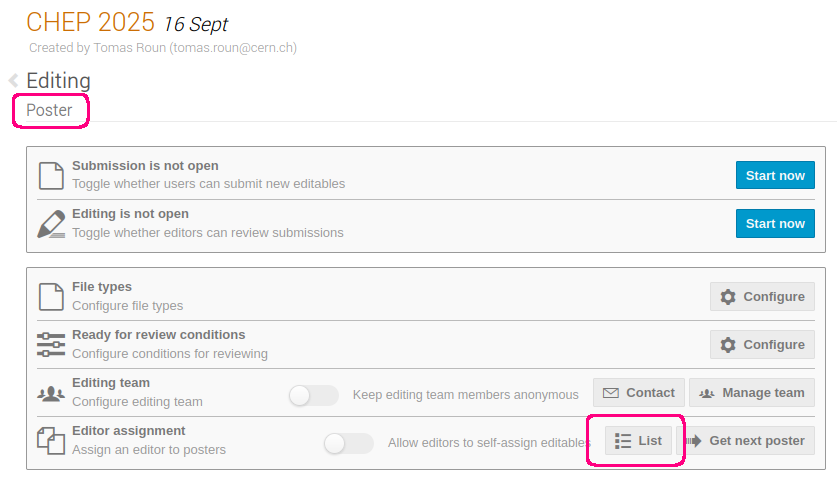

Here, you will see the list of all contributions. Contributions where an editable of the current type (visible in the page subtitle) has been submitted will be active, with the status saying _Ready for review_.

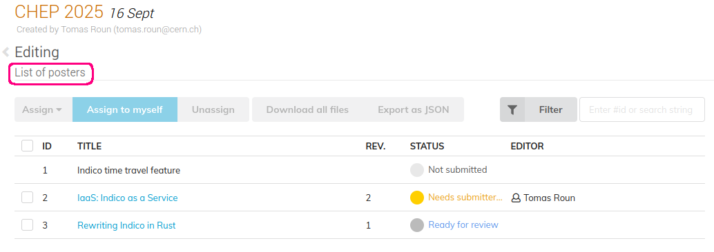

The _EDITOR_ column shows the currently assigned editor.

To assign an editor to an editable, select a contribution and click on _Assign_ in the top menu. You can also assign an editable to yourself by clicking on _Assign to myself_. To unassign a paper, select a contribution and click _Unassign_. Note that unassigning an editor will not remove their review from the editable.

This list of editables can also be used to quickly download materials from multiple editables using _Download files_. By selecting multiple contributions, you can download all of their files in one zip archive.

To simplify the assignment process, you can use the filtering options in the top menu. It is possible to filter by the assigned editor, contribution keywords, program code and the status of the editable. Searching by a string or an ID is supported as well.

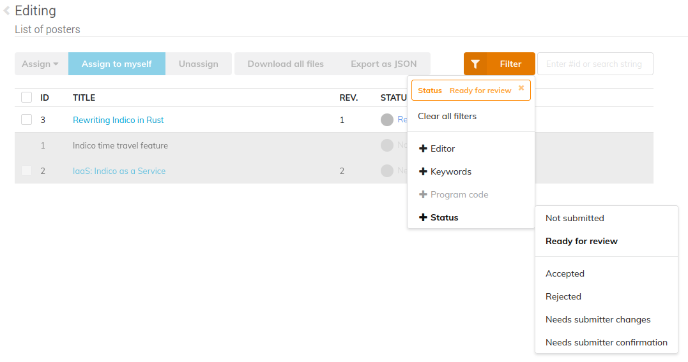

The possible statuses of an editable are:

- Not submitted
- Read for review
- Accepted
- Rejected
- Needs submitter changes
- Needs submitter confirmation

When no editable has been submitted yet, the status is _Not submitted_. After submission, an editable becomes _Ready for review_. At this point, an editor can be assigned and the reviewing process starts.
If an editable is accepted or rejected, the Editing process is finished. Accepted editables are automatically published in the contribution. The exact files which are published depend on whether the file type was set as _publishable_ in the file type settings.

If an editor judges a paper as _Needs submitter changes_, the author will be able to submit a new version for further review.
An editor can also submit a new version themselves - the status becomes _Needs submitter approval_ as the original author must approve the new version.
Once approved, the editable is automatically accepted. If the author rejects the changes, they will be able to submit a new version themselves instead.

Normally, only editing managers can assign papers to editors, however there is an option to allow editors to self-assign papers. The option can be found on the management
page for the given editable type in the _Editor assignment_ section - _Allow editors to self-assign editables_.

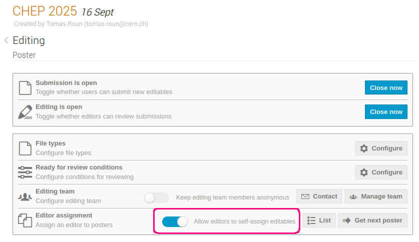

#### Permissions

The Editing module establishes new roles that Indico users may have. Here, we provide a list of what permissions are required in order to perform
the most common actions related to the Editing module.

| Action                               | Permissions required                                                 |
| ------------------------------------ | -------------------------------------------------------------------- |
| Submit a an editable                 | Abstract or contribution submitters                                  |
| Access the editable list             | Editors, editing managers and event managers                         |
| Judge/review an editable             | Editors, editing managers and event managers (must be assigned)      |
| Assign editables and manage settings | Editing managers and event managers                                  |

### Editing as an author

Authors can submit materials (papers, slides and posters) from the contribution page by selecting the editable type and uploading the relevant files.
To submit an editable, first click on _My contributions_ in the sidebar under _My conference_.

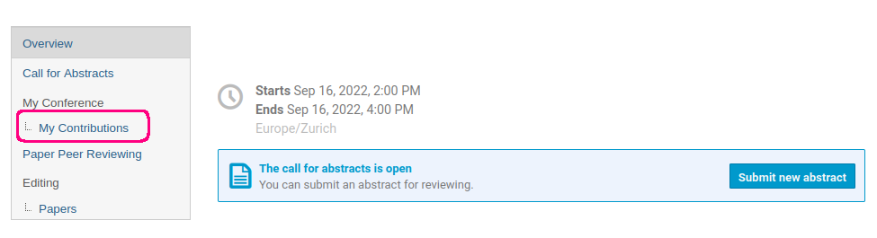

Here, click on the contribution for which you want to submit material and scroll down to the _Editing section_. If the section is not visible, then most likely submissions have not been opened yet. With the submissions open, you should have an option to submit:

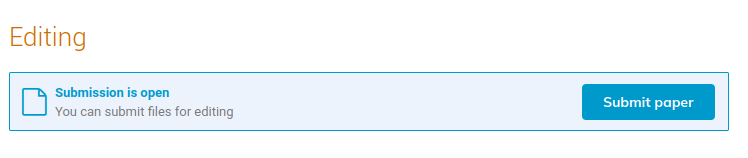

If multiple editable types have been enabled, you must first select the type of material you wish to submit from the dropdown:

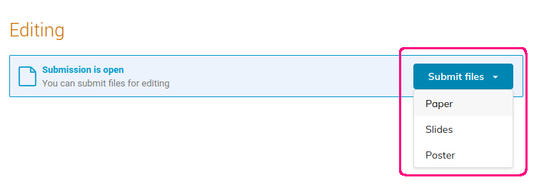

In the dialog window that opens, upload all the required files and confirm by clicking _Submit_.
If multiple file types are allowed, the dialog will display one box for each. The required file extensions are written in the top left corner of each box under the name of the file type. If a file of a specific type is required, there will be a red asterisk icon in the top right corner of the box.

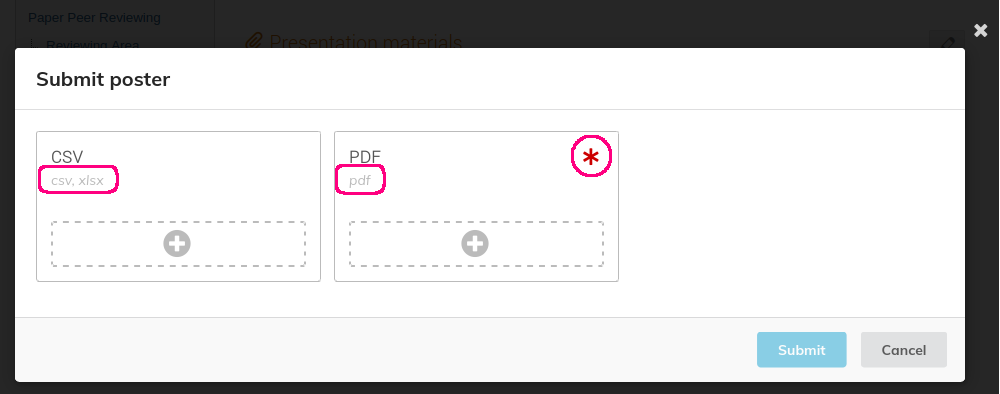

Once submitted, you can track progress of your submission from the contribution page by clicking on _Go to timeline_.

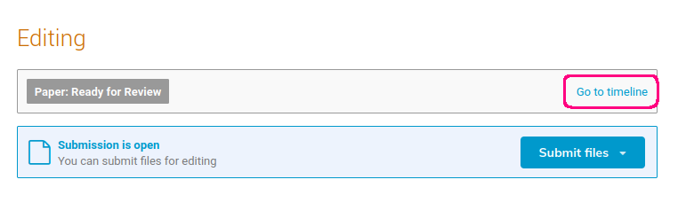

The timeline is where you will find all updates regarding your submission in chronological order.
As an author, you can add comments to your submission and upload additional files.

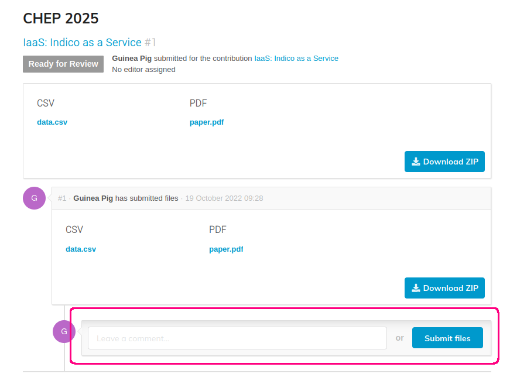

If you see a warning about unmet reviewing conditions, it means that, depending on the files you have already submitted,
extra files may be required as defined by the conference organizers, and you might be asked to provide them.

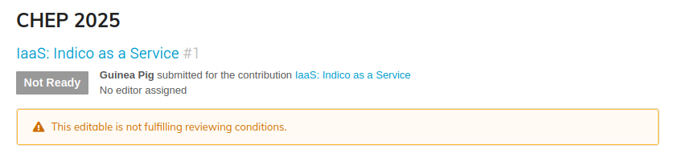

At this point, an editor will be assigned to your submission. They can either comment on the submission or leave a review.
A review comes with a proposed action. An editor might either accept or reject your submission. They can also ask for corrections, in which case the author
should upload a new, corrected version. Lastly, an editor can also submit a corrected version themselves. The author can then either accept the new version, which will automatically mark the submission as accepted, or reject it. If the editor's version is rejected, the author can submit a new version themselves.

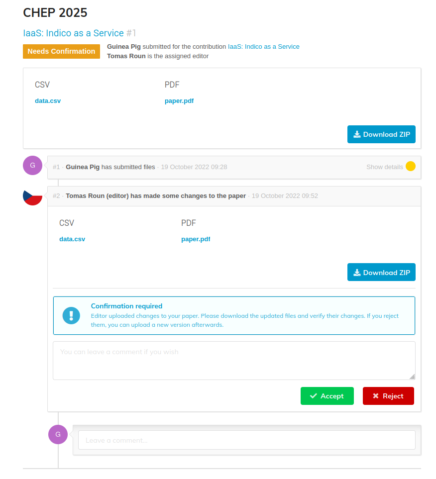

#### If the Peer Reviewing module is enabled

If the Peer Reviewing module is enabled, you can also submit a paper from the peer reviewing timeline once the paper has been accepted in the Peer Reviewing module.
To submit the paper in the Editing module, click on _Submit for editing_ and select the files you want to submit.

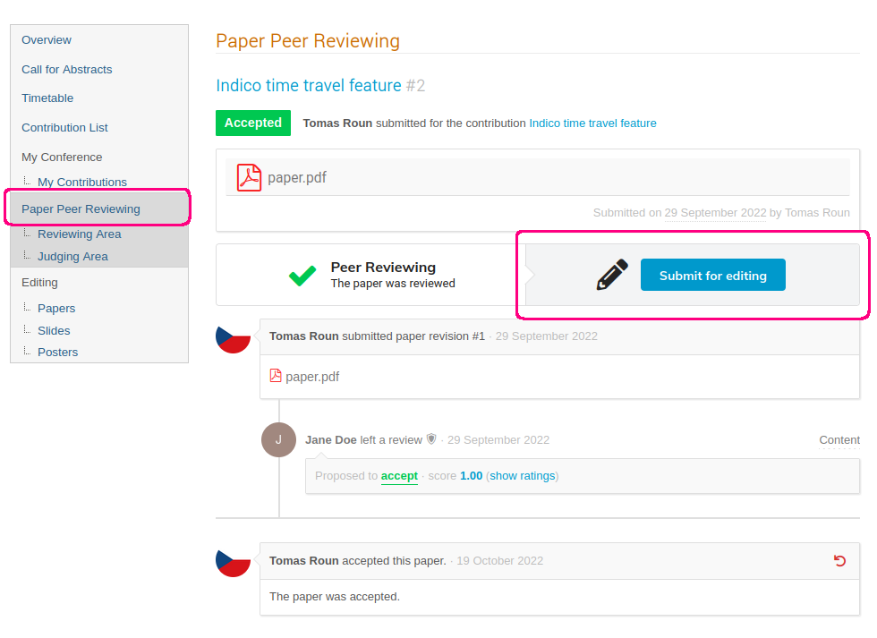

### Editing as an editor

Editors can find all papers to review in the _Editing_ section of the conference.
You will see different subsections (Papers, Slides, Posters) depending on whether you are a member of an editing team for that particular editable type.

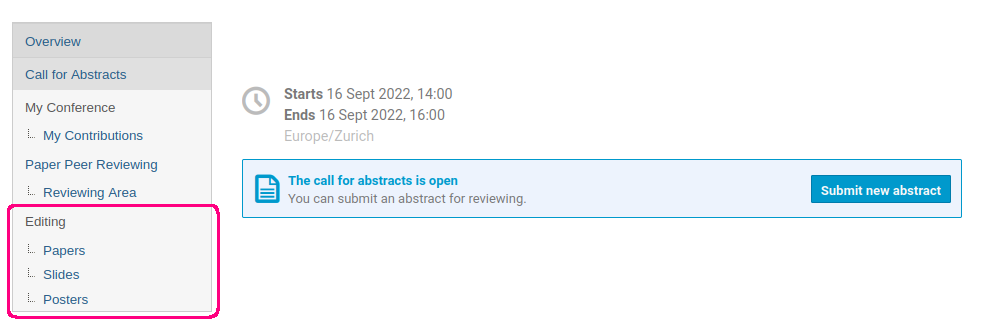

Clicking on one of the links will take you to the list of editables for the chosen type:

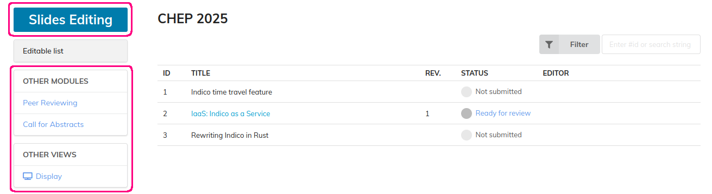

You can always see which editable type you are working with based on the title in the top left of the page. It will say either _Paper Editing_, _Slides Editing_ or _Poster Editing_.

The left sidebar contains links to other related modules - Peer Reviewing and Call for Abstracts, provided they have been enabled for the conference. Clicking on _Display_ will take you back to the conference page.

On the right, you will see a list of all contributions. Contributions that already have an editable submitted will be active. Clicking on the contribution name will bring you to the editable timeline. As an editor, you can leave comments on any editable, but you can only review editables that have been assigned to you by the editing managers. Each editable only has one editor assigned to it. The editor is listed in the _EDITOR_ column of the editable list. Each editable also has a status (column _STATUS_) indicating the state of the editable. Contributions without an editable have the status _Not submitted_ while contributions with an editable submitted are _Ready for review_.

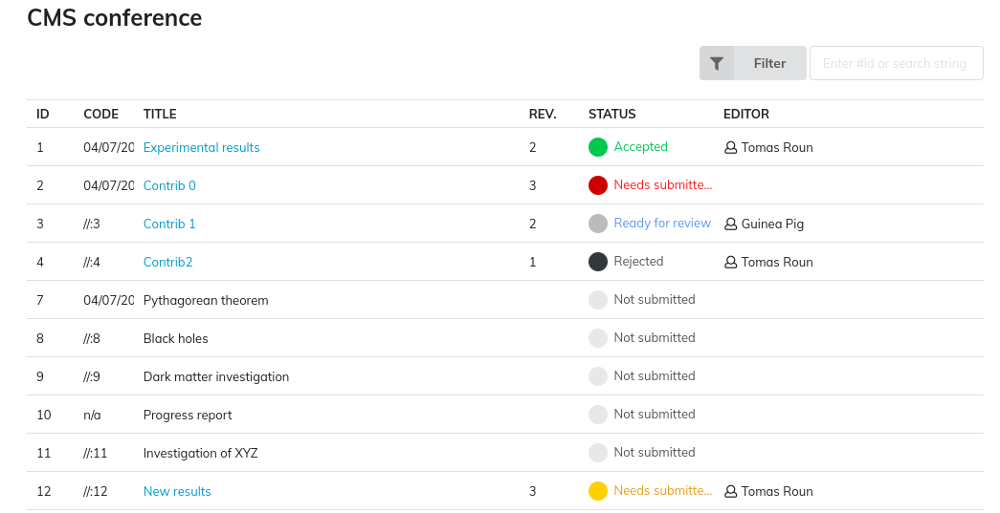

To quickly find out which editables are assigned to you, you can use the filter functionality. Click on _Filter_ in the top right, click on _Editor_ and select your name from the list.
Instead of filtering, you can also search contributions by name or by an ID as well.

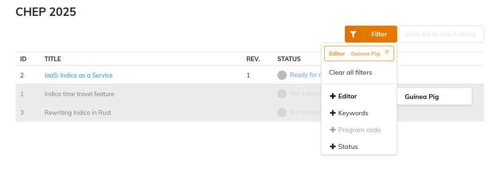

Once you have a found an editable assigned to you, click on the name to open the editable timeline:

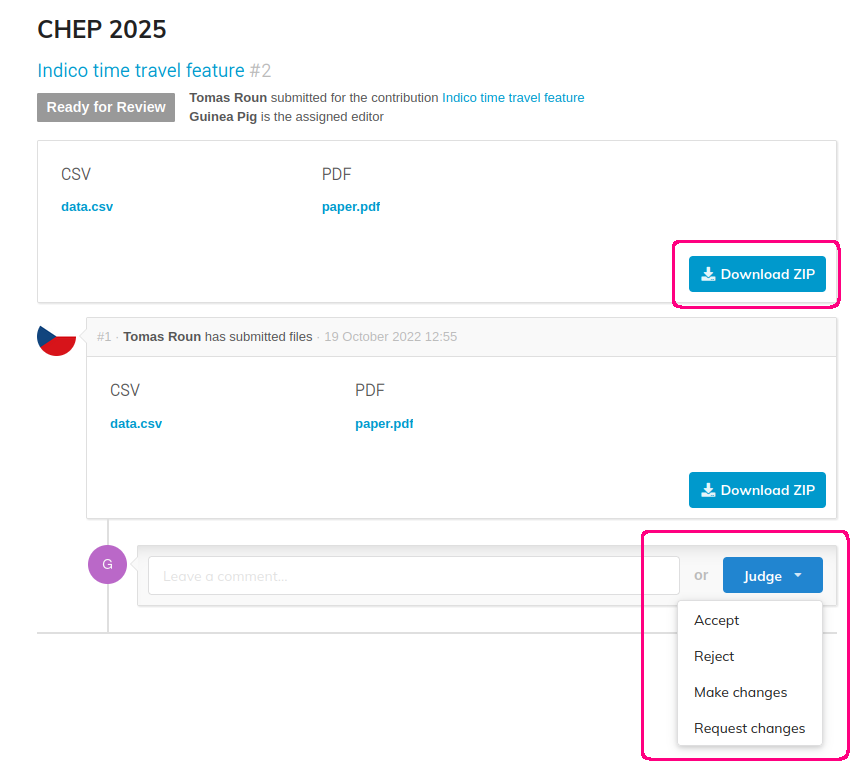

In the timeline, you can download the uploaded files by clicking on _Download zip_. It is also possible to download the files individually by clicking on the file names.
Once the editor has reviewed the files, they can judge the editable. There are four actions an editor can propose:

- Accept - The editable is accepted as-is, no further changes are possible unless the review is reset by the editor. The status of the editable is _Accepted_.
- Reject - The editable is rejected. No further changes possible unless reset. The status of the editable is _Rejected_.
- Request changes - The author will have an option to submit a corrected version, which will need to be reviewed. The status of the editable is _Needs submitter changes_.
- Make changes - An editor can upload a corrected version themselves. The changes must then be approved by the original author. The status of the editable is _Needs submitter confirmation_.

!!! note
    It is always possible to reset a judgment by clicking on the revert icon:
    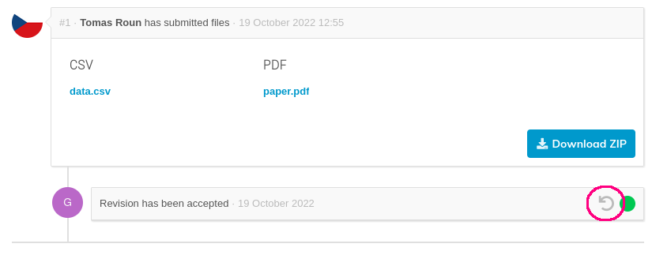

#### Self-assigning editables

If an editing manager has enabled the option to self-assign editables, there will be a button above the list of editables saying either _Get next paper_, _Get next slides_ or _Get next poster_ depending on which editable type you are currently viewing. Clicking on the button brings up a dialog window with the list of editables. You can use this list to search and assign editables to yourself.

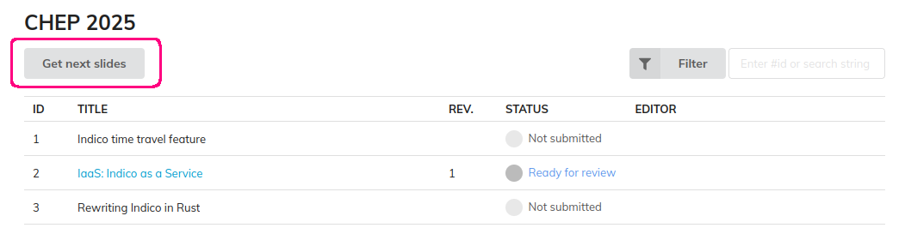
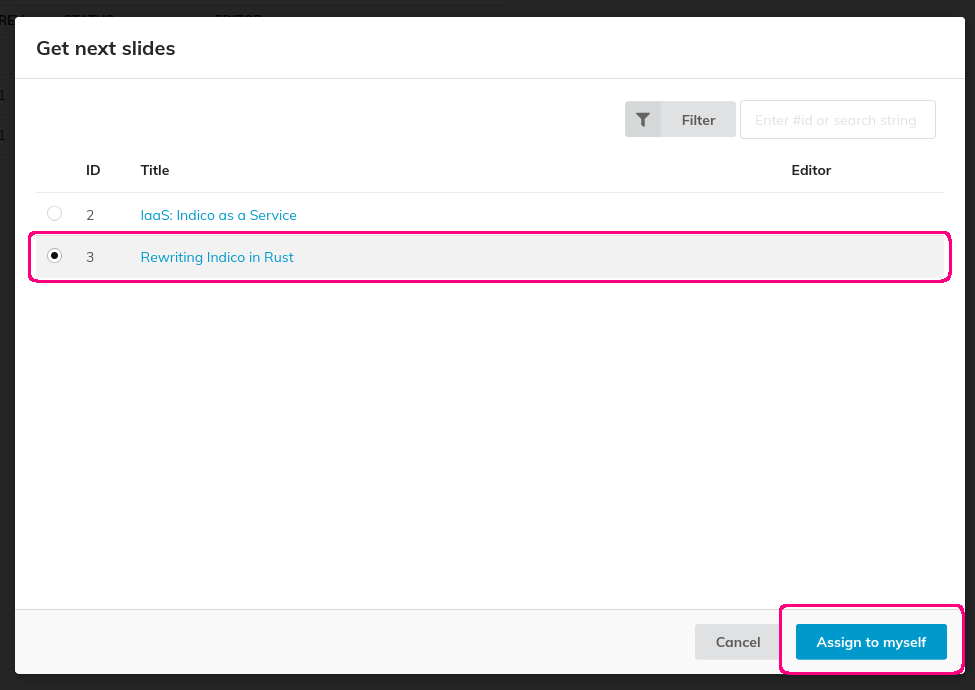

It is also possible to assign and unassign yourself from an editable in the editable timeline by clicking either _Assign myself_ or _Unassign_:

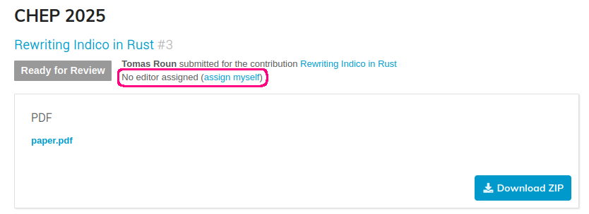
