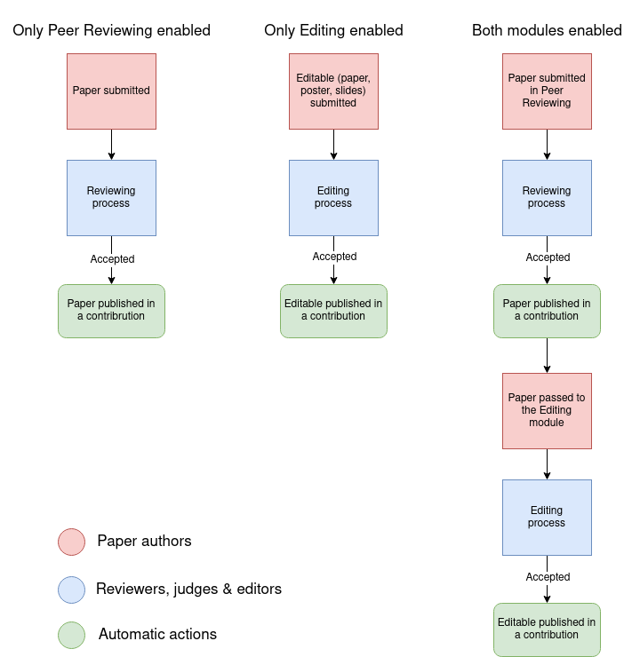

# Paper Reviewing

In addition to the [Call for Abstracts](../cfa.md) module, Indico offers two modules to support paper reviewing workflows:

- [Peer Reviewing](./peer_reviewing.md)
- [Editing](./editing.md)

Each of the modules allows you to submit, review and publish accepted papers.
The two modules can be used separately or together depending on your needs.

If this is your first time organizing a conference or your paper workflow is not overly complex, we suggest starting with the Peer Reviewing module first.

On the other hand, the Editing module is primarily intended to be used in conjunction with the Peer Reviewing module for complex conference workflows where multiple review steps are required.
When both modules are enabled, peer reviewing takes place first. Once peer reviewing is finished, the paper can be passed to the editing module. The basic idea is that peer reviewing is concerned about the content and scientific correctness of a paper, whereas editing is intended to focus on the material layout, review comments and editor suggestions.

Note that it is also possible to use the Editing module as a standalone module and keep the Peer Reviewing module disabled.

The biggest practical difference between the two modules is that in the Peer Reviewing module, multiple reviewers (peers) can review a paper. On the contrary, in the Editing module, each paper is assigned to a single editor for a review.

In addition, the Editing module allows authors to submit multiple types of materials. That is, besides papers, authors may also submit posters and slides as well (these together are called _editables_).
The Editing module also gives you more control over the type of files that can be submitted.

The following diagram shows the workflows for different configurations of the modules. Actions in red are carried out by the paper authors, actions in blue by reviewers, judges and editors, and green actions are performed automatically by Indico.

