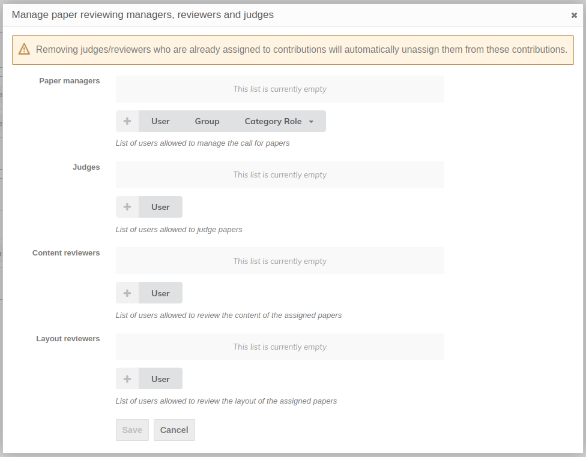
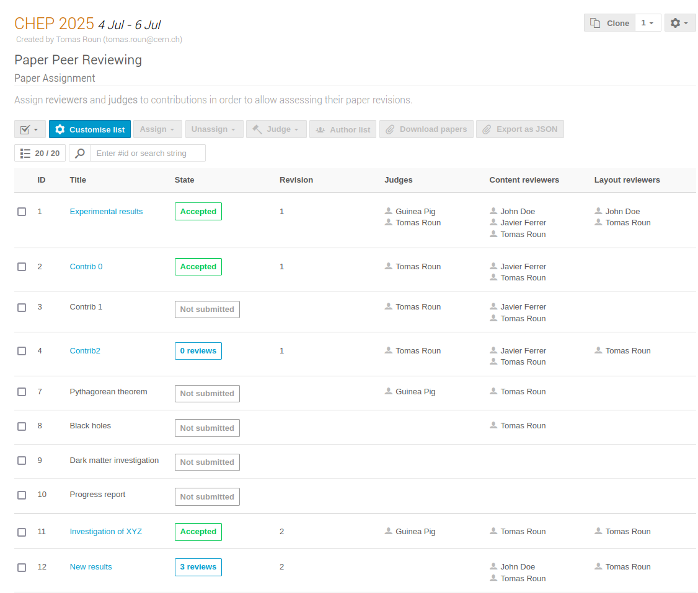

# Paper Peer Reviewing

### Introduction

This short video explains the Peer Review process and the reviewer's and judge's role in Indico:

<iframe width="576" height="360" frameborder="0" src="https://cds.cern.ch/video/2728255?showTitle=true" allowfullscreen></iframe>

The Peer Reviewing module allows you to

- submit papers for accepted [abstracts](../cfa.md),
- set up reviewing and judging teams and assign them to papers,
- review and judge papers and
- publish accepted papers.

!!! note
    If you're not sure which module to use, check the [introduction](./introduction.md) for a higher level description of the Peer Reviewing and Editing modules.

Here is a flowchart showing an overview of the peer reviewing workflow:

The following sections explain how to use the Peer Reviewing module from the point of view of organizers, authors, paper reviewers and judges.

### Setting up peer reviewing as a conference manager/organizer

#### Enabling the module

In order to start using the Peer Reviewing module, you need to first enable it.
From the event management page, click on the _Peer Reviewing_ tab in the left menu, under _Workflows_.
Finally, Click _Enable module_ to enable the Peer Reviewing module.

The module can be disabled at any time from the _Features_ tab under _Advanced options_.

Once the module is enabled, you will see new tabs appear in the conference's menu when switching
to the display area.

#### Uploading a paper template

If your conference requires papers to have a specific style or layout, you can help paper authors by uploading a paper template.
Authors will then be able to download this template from the _Paper Peer Reviewing_ tab of the conference.

To upload a template, select the _Peer Reviewing_ tab in the management area. Then, click on _Manage_ next to _Paper templates_.
Here, you can upload your template, give it a name and optionally a description. You can also upload more than one template if you wish.

The template becomes visible in the display area of the conference:

#### Setting up content & layout reviewing

The peer reviewing module allows reviewers to review the content and the layout of a paper separately.
You can enable one or both of these processes from the _Paper Peer Reviewing_ tab. By default, only the content reviewing
process is enabled.

In addition, it is possible to set a reviewing deadline for both content and layout reviewing. If a deadline is set, an information box will appear in the reviewing area
informing reviewers about the deadline. The deadline can also be enforced, which will also prevent reviewing after the specified date.

To set a reviewing deadline, click on the _Deadline_ button next to the reviewing process for which you want to set the deadline:

This is what reviewers see when the deadline is set:

Reviewers can also be presented with custom questions when leaving a review on a paper.
This can be useful when extra information besides accepting/rejecting a paper is needed from a reviewer.
There are the three types of questions that can be used:

- A rating
- A yes/no question
- A free text

Each question has a name, description and additional settings depending on the question type. Each question can also be configured as required
meaning, the reviewer is required to answer the question before leaving a review.

You can add reviewing questions by clicking the _Questions_ button next to the corresponding reviewing process.

This is what the various questions look like from a reviewer's point of view:

The scale of the rating questions (the minimum and maximum value) is the same for every question and can be configured in the reviewing settings:

!!! note
    Changing the minimum and maximum value of the ratings will scale all the existing answers proportionally.

#### Setting up paper judging

The only setting available specifically for judges is the judging deadline, which works the same way as the reviewing deadlines explained previously.
Once the deadline is set, an information box will appear in the judging area of the conference. If the deadline is enforced, judges won't be able to judge
papers after the deadline.

#### Reviewing settings

The reviewing settings let you configure an announcement, set the scale for rating questions (explained in previous sections) and manage email notifications.
The announcement can be used to display a message on the peer reviewing page for reviewers to see.

Email notifications lets you configure who and under which circumstances
should receive an email — for example, whether you want a judge to be notified when a paper is reviewed. The most common notifications are turned on by default, but you can fine tune them as you need. We will cover how to designate reviewers and judges and how to assign them to papers in the following sections.

To open the reviewing settings, click on the _Settings_ button next to _Reviewing settings_.

!!! note
    The content and layout reviewer columns in the email notification settings are only visible if the corresponding process is enabled.

Here is a screenshot of what an announcement may look like.
The announcement editor supports basic styles via Markdown. You can also embed images using a link.

#### Setting up reviewing teams

Before you can assign papers to reviewers and judges, it is necessary to set up reviewing teams.
These designate who has the right to review and/or judge a paper.

To get started, click on the _Teams_ button next to _Reviewing teams_.

From the dialog window, you can add paper managers, judges and content and layout reviewers. Paper managers have rights to manage the settings of the Peer Reviewing module.
You can also manage paper managers from the _Protection_ tab of the event by adding the _Paper manager_ permission.

Once the teams are set up, you may also wish to add _competences_ to your reviewers and judges.
Competences are keywords you can add that describe the person's area of expertise.
These keywords can aid paper managers in matching the right reviewer and/or judge to a paper.

You can manage competences by clicking on the _Competences_ button next to _Reviewing teams_.

The reviewing teams are also a handy to way to contact your reviewers and judges via email.
Simply click on the _Contact_ button and select the intended recipients.

Clicking on _Send emails_ will open a dialog window where you can write your email.

#### Enabling call for papers

If you've followed the documentation up to this point, you should now be ready to open the call for papers.
That is, allow authors to submit papers for a review.

To open the call for papers, you can either click _Start now_ which will open the call immediately or you can click on _Schedule_
and select the start and end date of the call instead.

Once the call for papers is open, you will also have the option to close or reschedule it from the same place.

#### Paper assignment

With the call for papers open and papers being submitted, it is the paper manager's job to assign reviewers and judges to the submitted papers.
Reviewers and judges can only work on papers that have been explicitly assigned to them.

To open the paper assignment page, click on _Assign papers_ next to _Paper assignment_.

This page serves as an overview of all the papers that have been submitted and their state. To assign a person to a paper, first select the paper and click on
_Assign_ in the top menu. Select the desired role from the dropdown menu and from the opened dialog select the people to should be assigned this role. Here, you will also see the competences of each
person specified previously.

It is also possible to assign people to multiple papers at once. To do that, simply select several papers and follow the same procedure.

To remove a person from a paper,
select the paper and click _Unassign_ in the top menu and select the role to remove from the dropdown menu. In the newly opened dialog select the person to remove and confirm your selection by clicking _Unassign_.

#### Permissions

The peer reviewing module establishes new roles that Indico users may have. Here, we provide a list of what permissions are required in order to perform
the most common actions related to the Peer Reviewing module.

| Action                            | Permissions required                                                 |
| --------------------------------- | -------------------------------------------------------------------- |
| Submit a paper                    | Abstract or contribution submitters                                  |
| Review a paper                    | Paper reviewers and event managers (reviewers must be assigned)      |
| Judge a paper                     | Paper judges and event managers (judges must be assigned)            |
| Assign papers and manage settings | Paper and event managers                                             |

### Peer reviewing as a paper author

In a typical conference workflow, the first thing to do before uploading a paper is to submit an abstract. Once the abstract is accepted by the organizers, a new contribution is automatically created. You can see all your contributions on the _My contributions_ page.

Once the abstract has been accepted, you will be able to submit a paper, provided the call for papers is open. You can submit a paper from the _Paper Peer reviewing_ page by clicking on _Submit paper_. If you have multiple contributions for which you can submit a paper, you will be asked to choose one.

You can also submit a paper directly from the contribution page.

Once you have submitted your paper, you will be able to track its progress from the _Paper Peer reviewing_ page under _My papers_.

At this point, reviewers may leave reviews on your paper with suggestions and propose to accept, reject or correct your paper. As the author, you will be notified of all activity concerning you via email. A paper judge may also request corrections to your paper, in which case you will be able to upload a new version of your paper.

Once the paper is accepted, it will be published in the corresponding contribution.

### Peer reviewing as a reviewer

As a reviewer, your job is to review the submitted papers and to propose an action - to _accept_, _reject_ or _correct_ the paper. Paper judges will take your feedback into account when deciding what to do.

You can only review papers that have been assigned to you specifically.
You can see the papers in the _Reviewing area_ of the event under _Papers to review_. The papers that you have already reviewed will appear under _Reviewed papers_.

You may be requested to leave a content review, a layout review, or both. The exact definition of these will depend on the specific event and the organizers, but in general, a content review is concerned with the text and its correctness and completeness while a layout review judges the style and appearance of the paper and whether it complies with the guidelines of the given conference.

To review a paper, first select one paper from the list of papers to open the paper timeline. At the top of timeline page, 
you can download the latest version of the submitted paper. Once you have read the paper and are ready to add a review, click on _Review_.

If you have been requested to review both the content and layout, you will see a dropdown where you have to choose which type of review you want to add.

Once selected, you need to choose a proposed action - to _accept_ or _reject_ the paper or to _request corrections_.
If the organizer added extra reviewing questions you may be required to answer them in order to add a review.

You can edit your review later as long as there is no judgment yet. This can be done by clicking the edit icon on your review.

You may also comment on a paper without leaving a review. You can set the comment visibility so that it is only visible to, e.g. judges. This is useful for discussing sensitive topics without the author seeing.

If a judge requests corrections, reviewers will be able to review the corrected paper.

### Peer reviewing as a judge

The workflow of a paper judge is largely similar to that of a reviewer. Judges can only judge papers assigned to them by paper managers.
The list of papers that you can judge is available in the _Judging area_.

Paper judges have the final say when it comes to accepting a paper. They can either accept or reject a paper or request corrections. If corrections are requested,
the author of the paper will be able to submit a new version which needs to be judged again.
Note that a paper can only be judged by one judge.

Before adding a judgment, make sure that reviewers have had the chance to review the paper. You can see the assigned content and layout reviewers in the _Judging area_.

Judgments can be reset by clicking on the _Reset judgment_ icon in the judgment box:

As a judge, you can also leave comments on a paper before adding a judgment.

!!! note
    Both reviewing and judging might have a set deadline, after which it is not possible to review or judge papers. If a deadline is set, you will see it in the Reviewing and Judging areas.
    
