# Paper Peer Reviewing

This short video explains the peer review process and the Reviewer's and Judge's role in Indico:

<iframe width="576" height="360" frameborder="0" src="https://cds.cern.ch/video/2728255?showTitle=true" allowfullscreen></iframe>

Read about this process in detail below.

> **Note**: To enable the upload of conference materials and proceedings, at least one of the following modules must be enabled: Editing or Paper peer reviewing.

### Peer Reviewing management

From the event management page, click _Peer Reviewing_ on the left banner, under _Workflows_.

Click _Enable module_ to enable the _Paper Peer Reviewing_ module.

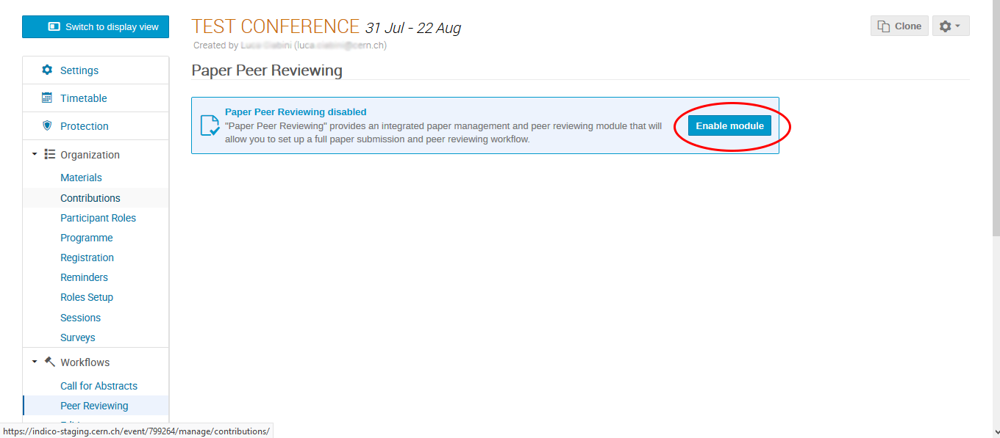

In the management page click _Start now_ to open _The call for papers_.

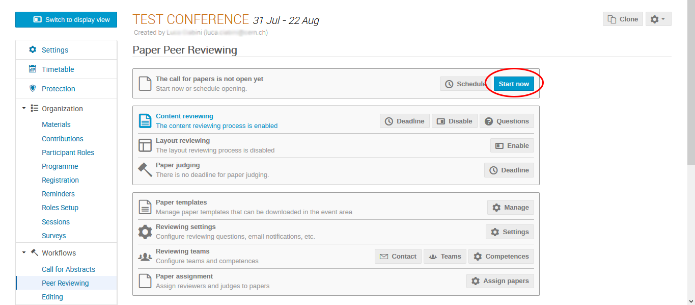

From the management page you can also enable _Content reviewing_, _Layout reviewing_ -generally only if the _Editing_ module is not activated (see the Editing section in this documentation)-,
and set a _Deadline_ value for _Paper judging_.

To set teams' responsibilities click on _Teams_.

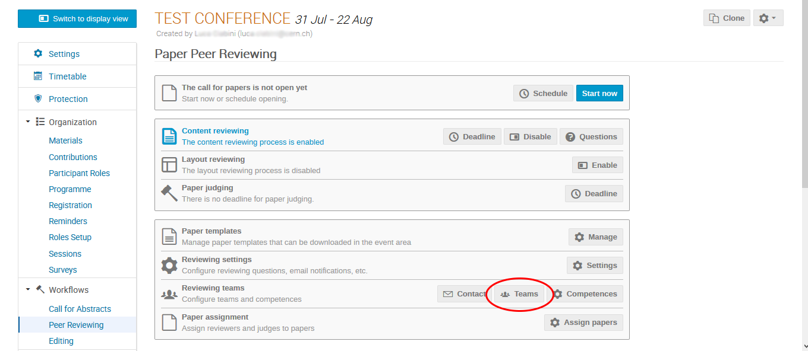

From this page you can now select the _Paper managers_, _Judges_ and _Content reviewers_.

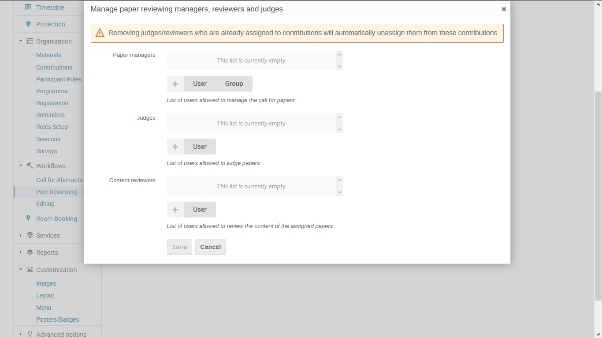

Click on _Assign papers_ to open the list of papers and assign each of them to the reviewer and the judge.

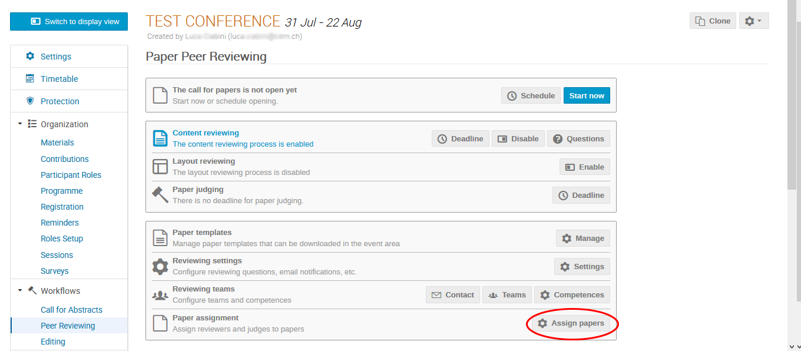

### As a paper submitter

From the event display view, as a paper submitter, click on the _Paper Peer Reviewing_ area.

Click on _submit paper_ .

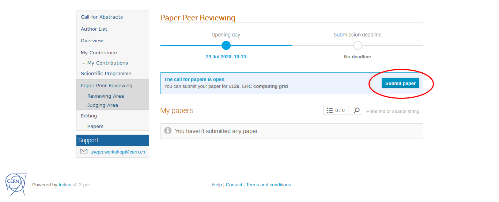

Now you will be asked to select a paper from your computer.

After selecting the paper click on _Save_.

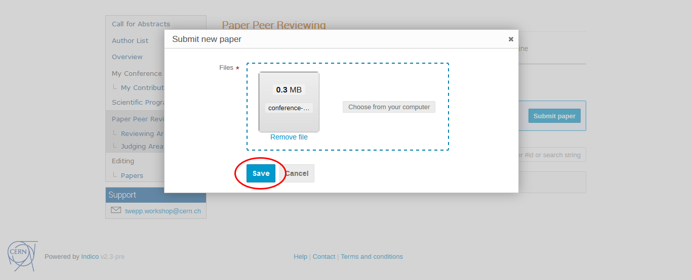

If the judge of your paper gives the judgment: "_To be corrected_", you will be able
to _Submit a new revision_ of the paper in the _Paper Peer Reviewing_ area.

Select the new revision and then click on _Submit new revision_.

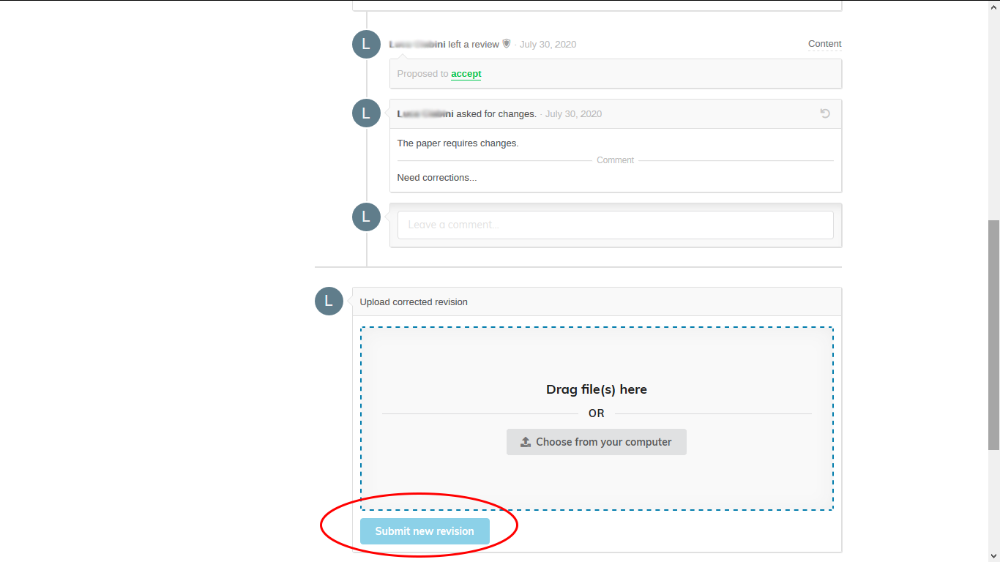

### As a paper reviewer

From the event display view, as a paper reviewer, click on the _Reviewing Area_ under _Paper Peer Reviewing_.
See the list of papers you are a reviewer of.
Click on the paper you want to review to access it.

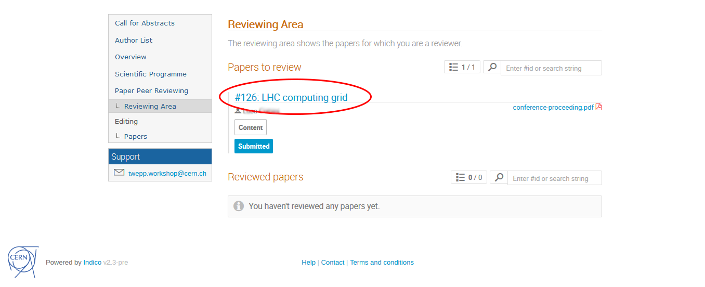

Under the submission you will see a textbox to add a comment and a button to review the paper.
Click on _Review_.

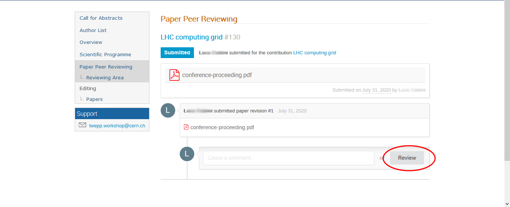

You will now see a drop-down menu **(1)** where you can choose one action:

- "_Accept_" to accept the paper
- "_Reject_" to reject the paper
- "_To be corrected_" to request changes

You can also add any comments below.

Click on _Submit review_ **(2)** to submit the review.

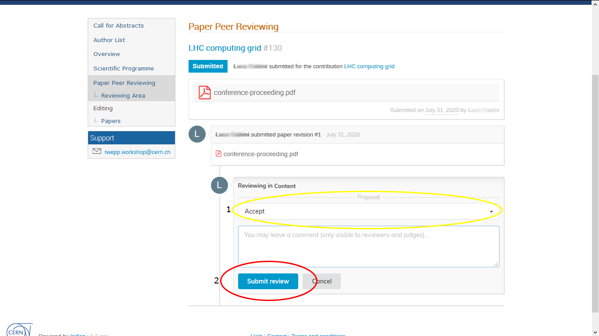

### As a Judge

From the event display view, as a judge, click on the _Judging Area_ under _Paper Peer Reviewing_.
See the list of papers you are a judge of.
Click on the paper you want to judge to access it.

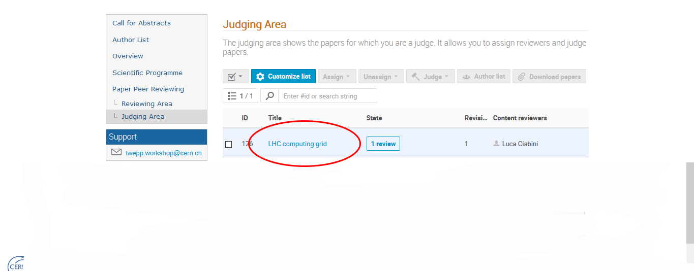

After selecting your decision from the dropdown, click on _Judge_ **(2)** to submit your judgement.

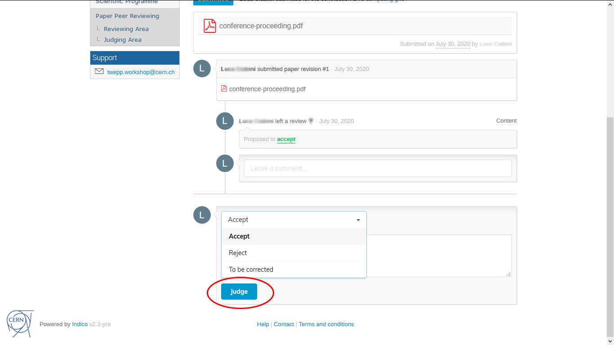
