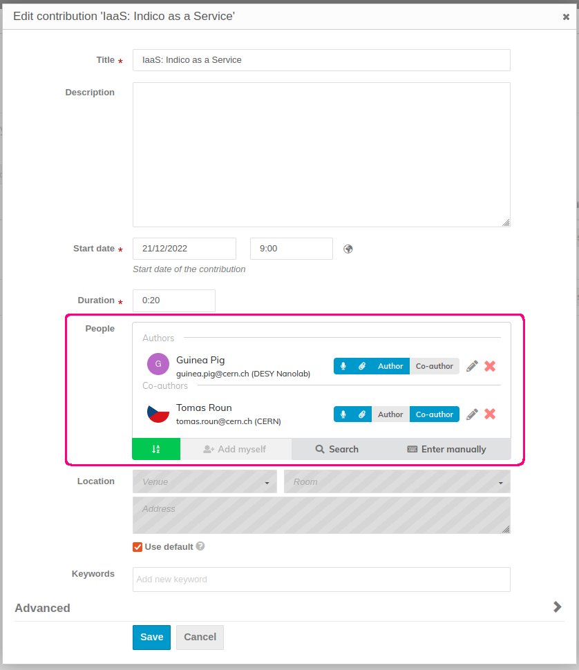
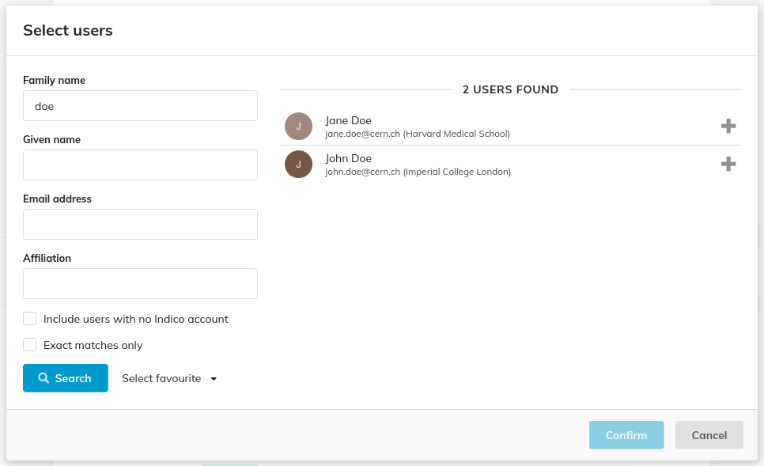
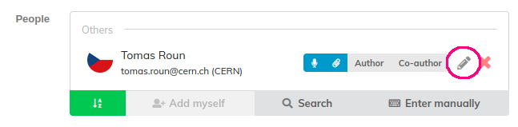
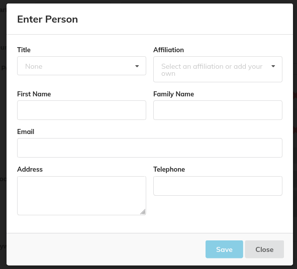
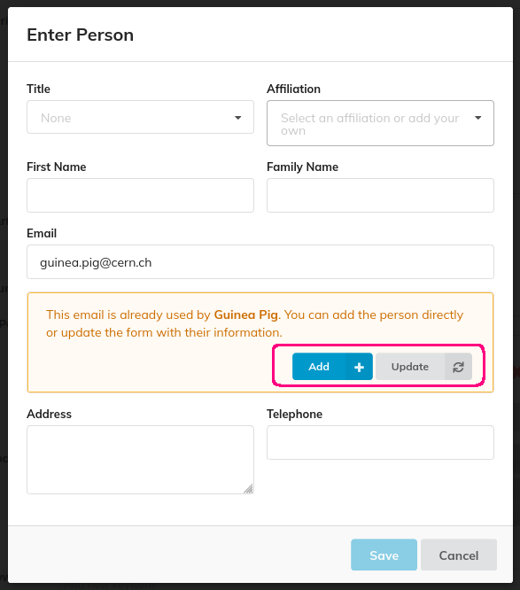

In some parts of the event you might need to link other users.
These could be authors and/or speakers in contributions and abstracts, event chairpersons, session conveners or
lecture speakers.

To add an existing user, use the search functionality by clicking on _Search_.
You can search users by their name, email and affiliation:

When a user is linked to an event, Indico stores a copy of the user's details such as the name, title and affiliation in the event.
This preserves the personal data at the time the event took place. If in the future the user changes e.g. their affiliation,
the event will still display the affiliation they had at the time of the event.

The details of a user can be edited by clicking on the edit icon. Note, however, that since the event only stores a copy of the user's data,
editing user details will only have an effect inside the event. It will not affect the Indico user nor any other event where the user is taking part.

It is also possible to add people who have no Indico account whose data will only be stored in the event.
You can add a person this way by clicking on _Enter manually_.
Note that people added this way will still need to create an Indico account in order to e.g. submit materials.

Here, you can fill the personal data. If you fill in the email, Indico will automatically check for existing users and will notify
you in case there is already a person with that email in the event, be it an Indico user or another person added manually.

If a person with the email already exists, you can click on _Update_ which will fill the form with the person's data.

After updating the form, you can tweak the data further before confirming by clicking on _Save_. This adds the person to the list and updates their data in the event.

The _Add_ button is simply a shortcut which fills the form, replacing anything you may have written before and confirms automatically.

Note that you can always edit the details later by clicking on the _Edit_ icon.
