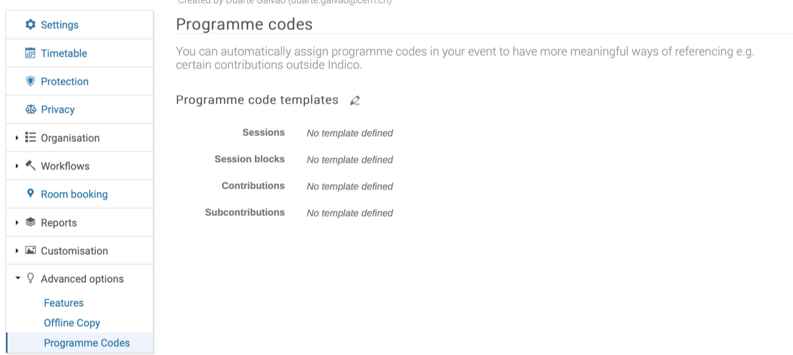
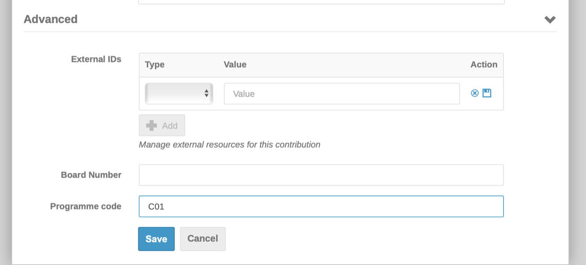
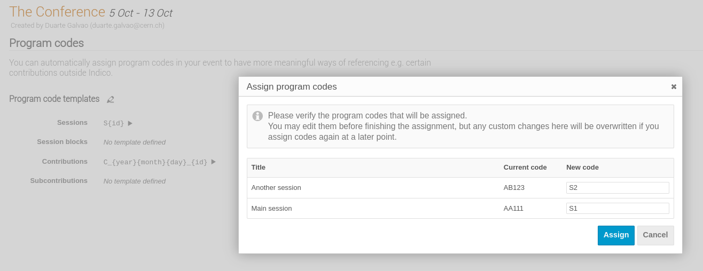
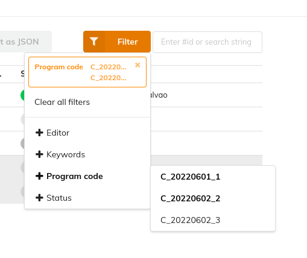

# Programme Codes

Programme codes are a way to designate certain items (sessions, session blocks, contributions and subcontributions) so that they can be referenced more easily outside Indico.
These codes can either be set manually on each item or be generated automatically based on pre-configured sequences, which can be specified on the _Programme Codes_ tab in the _Advanced options_ by editing the templates.

Each item can have one code.
The code for each of these items can be manually set when editing it - for instance, for contributions, when you open the editing dialog, there is a _Programme code_ field in the _Advanced_ section.

To automatically assign codes to existing items, you must set a template in the Programme codes tab in the advanced options, and then press the arrow next to the template.
For example, for sessions, you can set `S{id}` as the template, and the generated session codes will be `S1`,`S2`,...,`Sn`, in order of creation. For contributions you can set something like `C_{year}{month}{day}_{id}`, and the generated codes would be something like `C_20220601_1`, `C_20220602_2`, ...

Programme codes are also useful for sorting parallel sessions and session blocks in the timetable, and as a filter criteria on the editables list.

