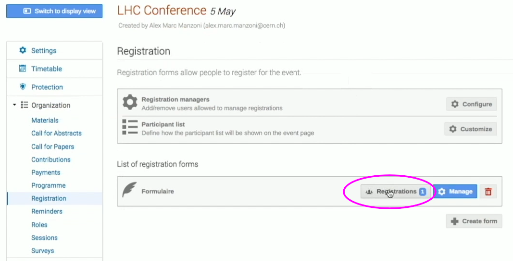
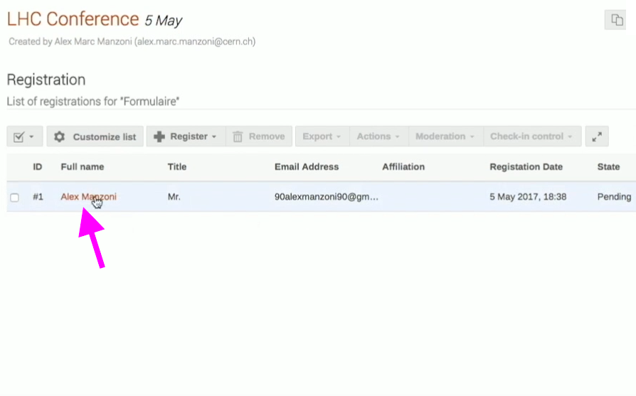

This short video explains how you can register/apply and pay for your participation in a Conference using Indico:

<iframe width="576" height="360" frameborder="0" src="https://cds.cern.ch/video/2275654?showTitle=true" allowfullscreen></iframe>

Follow these steps in detail here:

### Register/Apply & pay as a candidate participant

As a user, candidate Conference participant, you can place a Registration or an Application, if the event is moderated.

On the event overview page, click on _Apply now_.

Fill out the form, e.g selecting your preferred options for _Accomodation_, the _Arrival_ and the _Departure date_.

Click on _Apply_ once you’re finished. You may need to wait for event manager's approval, if the moderation option is enabled.

Once the event manager has approved your Application, you will be able to place the payment.

On the page that will appear after having filled the Application form, a _Checkout_ button will appear at the bottom. It will direct you to a page, where you will be able to pay with the options enabled, e.g. bank transfer and/or PayPal.

### Approve Conference Applications as an event manager

As event manager, click at the pencil at the top to return to your event management page.

Click on _Registration_ at the left banner, under _Organization_. As a manager, you may click on _Registrations_ to see the pending registration.

Simply click on the name of the applicant, and click on _Approve_ , if you agree.

