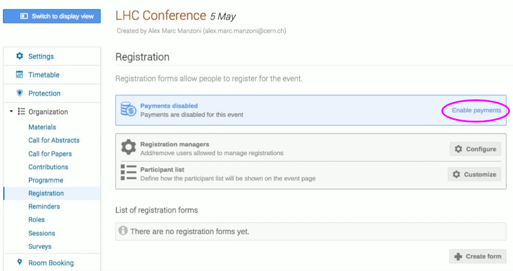
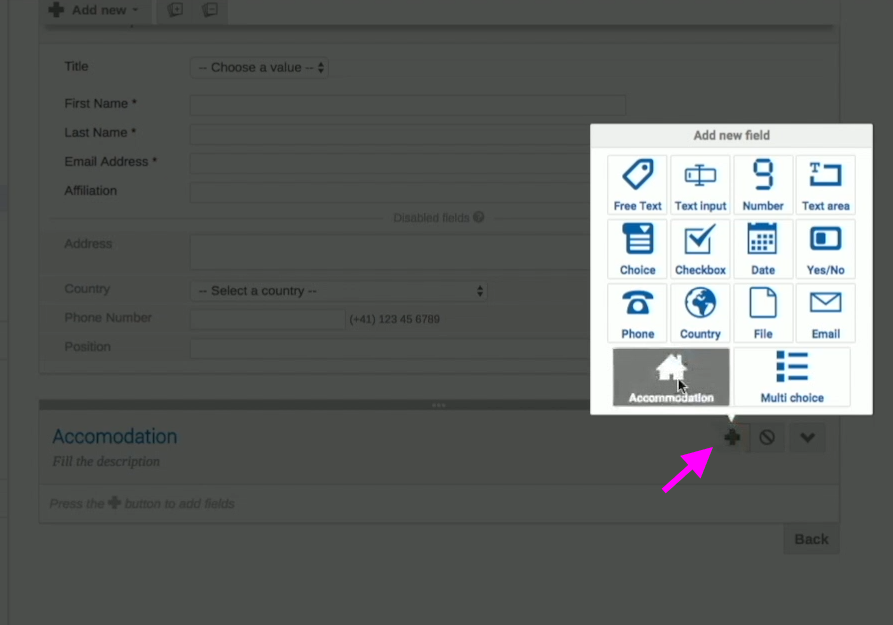
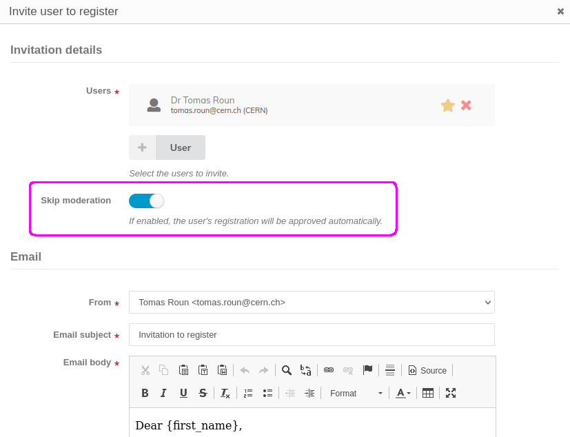

This short video is a tutorial on how to define Registration forms in Indico:

<iframe width="576" height="360" frameborder="0" src="https://cds.cern.ch/video/2275648?showTitle=true" allowfullscreen></iframe>

These steps in detail:

### Enable payments

As event manager, enter the event management area  and click on _Registration_ on the left banner. As you can see in the image below, payments are disabled by default.

To change this, simply click on _Enable payments_, and _Confirm_.
At this point, a button called _Payments_ will appear on the left banner. Click on this button to see several payment options. Click on one of the payments options available to enable it, e.g. choose the _Bank transfer_ option, in which case you will have to select _Enable_, and insert the IBAN code of the bank account where the payment should be deposited.
You can do the same for other options such as _PayPal_, using the PayPal ID you needed for the Conference payment.

### Related Registration configuration steps

From the _Registration_ page of the event management area, click on the _Create form_ button.

Give a _Name_ to your registration form. The most important of the options available is the _Moderated_ workflow option. If, as a Conference event manager, you select the option _Moderated_, this means that the manager has to approve any user registration first.

Be careful about the Registration _Modification allowed_ option, because of the electronic payment features. It is wise to allow modifications only **until** the payment is done or simply select _Never_. This is because change of such _Settings_ after payment may entail change of the total due amount!

In _Price options_, select the currency and enter the fee.

Further down the same page you may configure _Notification_ headers and text for emails to be sent to the Registrants and to the event managers. Click on _Save_ when you are finished!

Click on _Configure_ on the right of the _Registration form_ row.

A form is offered to you by default, you can add sections to it, by clicking on _Add new_ at the top and then _Section_, e.g. select the label _Accommodation_ and click on _Add_. Then click on the _+_ sign, in your section and select the _Accomodation_ option.

on caption, write “Accommodation”.

Go to _Configuration_ on the left banner, and select a few dates available.

Then go to _Edit accomodations_ on the left banner.
The default option is _No accomodation_, but you can change that by clicking on _Add new accomodation_ to add some, including the room price and places' limit. Enter the necessary data and click on _Add_.

You can add various new fields, suitable for your event, by clicking on the "+" signs of the sections defined. The sections are drag and drop!

When done with this configuration, click on _Back_ at the bottom of the page on the right.

### Manage invitations

From the event management page, click on _Manage_ on the _Invitations_ row.

A list of people that will receive an email invitation to the event can be defined here. The email will contain a link to the Indico registration form for the event. They can either _Accept_ or _Decline_ the invitation.

Click on _Invite_, you can either invite Indico users (by searching and adding them) or external people.

If you want to accept the registration of the users you send the invitations to right away, without the need for a confirmation first, select _Yes_, on _Skip moderation_. Click on _Send_ when your invitation is complete.

Return to the registration page, by clicking on _Registration_ on the left banner. Click on _Manage_, near _Registrations_.
Click on _Start now_, in order to open the registration process.

