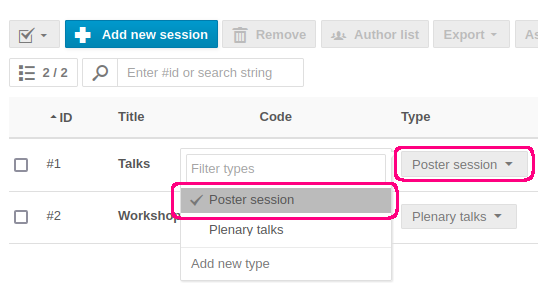
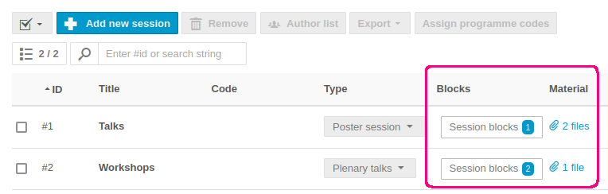
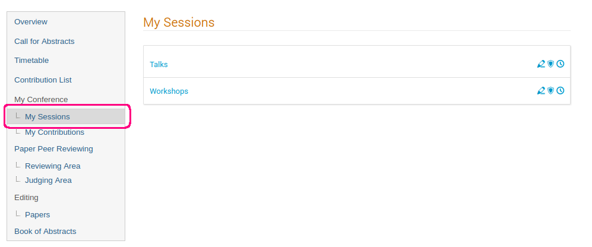

This page explains the purpose of _Sessions_ in Indico and how to use them.

Put simply, sessions are a way to group related contributions when creating a timetable.
As an example, a conference could be split into a welcome session, a session dedicated to talks, workshop sessions etc.

In this part, we will cover how to create and manage sessions from the organizers' point of view. If you want to learn how sessions are used when creating a timetable, see [this page](./timetable.md).

### Creating a session type

Before creating a session, we will first create a session type. Session types can help you better organize your sessions but they are not required unless you want to use poster sessions (see the [timetable page](./timetable.md) for more details).

To create a new session type, navigate to the management area of an event and select _Sessions_ under _Organisation_.

At the top, click on _Settings_ and select _Session types_ from the dropdown.

In the new dialogue, click on _New session type_ and select a name.

If you toggle _Poster_, any session with this session type will become a poster session. When creating a timetable for a poster session, all contributions in a session block are automatically scheduled in parallel with the same start time and duration. See the [timetable page](./timetable.md) to learn more about session blocks and poster sessions.

### Creating a session

To create a session, navigate to the management area of an event and select _Sessions_ under _Organisation_. This page shows the list of all your sessions. To create a new session, click on _Add new session_ in the top menu.

In the dialogue window, fill in the title and optionally the remaining fields. You can select the session type from the dropdown in the _Type_ field. These are the session types we created previously. The _Default contribution duration_ field controls the default duration of contributions you schedule in this session.
You may also choose a default location for session blocks in this session. The available locations come from the [Room booking module](../room_booking/about.md). If you don't select any location, the location of the event is used as a default instead. Once you have filled in the dialogue, click on _Save_ to create the session.

You can always edit the session later by clicking on the pencil icon on the right of the session:

### Managing a session

Once a session is created, you will see it added to the list of sessions. 
From the list, you can quickly change the session type. To remove a session type completely, simply click on the type again, which will unselect it.

You can see the scheduled session blocks in each session in the column _Blocks_. To upload material to the session, click on the link in the column named _Material_. This will bring up a dialogue window where you can upload files to the session. Note that this adds the files to the whole session, not to a session block.

The uploaded files will be visible in the event timetable in every session block belonging to that session. The files are also available in the session details under _Presentation materials_.

To view the timetable for a specific session, click on the clock icon on the right:

To delete a session, click on the bin icon. Beware that deleting a session will delete all its session blocks and unschedule all contributions within them.

By default, event managers can manage all aspects of a session - edit the data and manage session blocks and contributions. If you want additional users to be able to manage a session, click on the shield icon:

In the new dialogue window, you can choose who else can manage the session. You can either select full management rights, which will give total control over the session, or grant only _Coordination_ rights.

The so-called session coordinators can by default view the session data, schedule contributions and create breaks. Session coordinators can also be given additional rights from the main _Protection_ page of the event under _Session coordinator rights_.

By toggling _Contributions_, session coordinators will also be able to modify contributions in their sessions. By toggling _Session blocks_ as well, session coordinators will be able to manage session blocks, including creating new ones.

Any person who is explicitly assigned as a manager or a coordinator of at least one session will be able to manage their sessions from the main event page under _My sessions_:

### Distinction between session coordinators and conveners

Both coordinators and conveners are related to sessions, however there is a difference between the two.
Session coordinators are a role which comes with extra rights. They can manage their sessions and the extent of their rights depends on _Session coordinator rights_ explained previously.

On the other hand, session conveners are more similar to contribution speakers in that they do not gain any extra rights over the session. Session conveners are merely the people displayed in the timetable in the top right of each session block:

See the [timetable page](./timetable.md) to learn how to assign conveners to session blocks.
