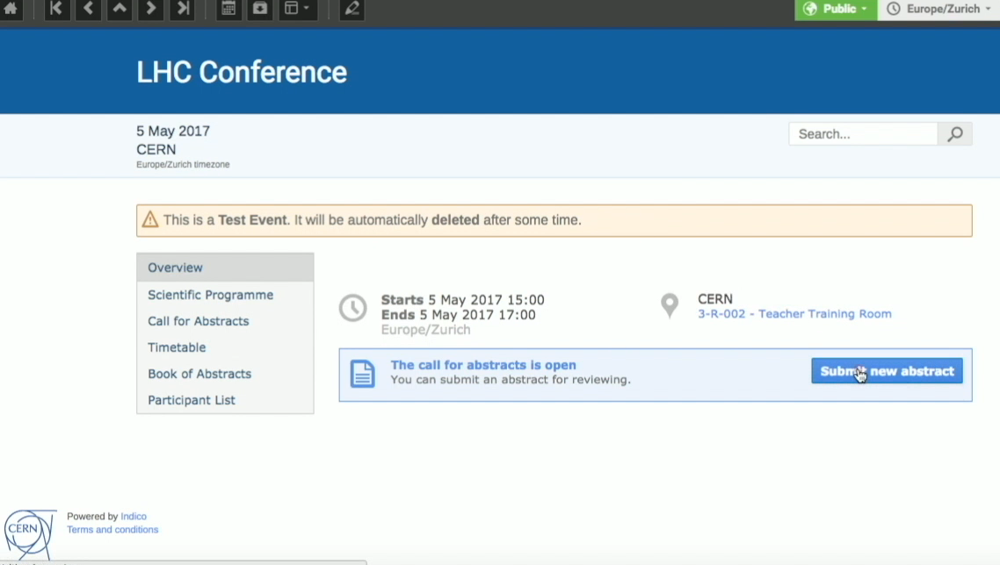

# Submitting an Abstract

This short video shows you how to submit your candidate Abstract for a conference in Indico:

<iframe width="576" height="360" frameborder="0" src="https://cds.cern.ch/video/2275344?showTitle=true" allowfullscreen></iframe>

In more detail:

Acting as an Abstract **Submitter** click on _Submit new abstract_.

Enter a _Title_ and the content of your abstract.

Select its _Type_, e.g. _Poster_, and add the _Author_ of the abstract. They can be more than one.
Click on _Speaker_ for at least one of your Authors.
Choose the _Track_ your abstract belongs to and answer the questions present there, if any.

Click on _Submit_.

If the notification options in the Call for Abstracts have been enabled, you, as the abstract submitter, should receive an email  on successful abstract submission.
By clicking on the Abstract name, the Submitter can see if Reviewers (normally more than one) left a positive or negative review, and if the Abstract has been accepted by a Judge.
