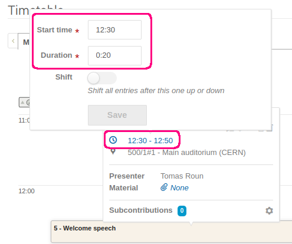

In this page, we'll show how to create a timetable for a conference. This page covers all the available timetable features and settings. If you are creating a timetable for a meeting instead, you might want to see [this page](../meetings/timetable.md) first, which covers the basics.

Even though most of the focus of this explanation is on conferences, most of what we show can be applied to meetings as well. We point out the few places where the behaviour is different.

### Anatomy of a timetable

Regardless of whether you are organizing a meeting or a conference, a timetable is made up of four basic elements:

- Sessions
- Session blocks
- Contributions
- Breaks

Sessions group together related contributions (talks/presentations). These contributions are organized into session blocks. A session block is an 'instance' of a session with a defined start and end. For example, a session could be split into a morning and afternoon block. Note that sessions cannot be directly scheduled in a timetable, only session blocks can. A more thorough explanation of sessions can be found [here](./sessions.md).

The use of breaks is to signal a pause in the programme, such as a lunch or a coffee break.

An example of a meeting timetable might look like this:

This timetable only uses contributions. Many meetings are relatively simple and don't require the use of breaks or session blocks which are normally used in conferences, however it is still possible to use them nonetheless.

An example conference timetable might look like this:

Using the detailed view:

In this timetable, there is one top-level contribution (Welcome speech) and two sessions (Talks & Workshops). The _Talks_ session has two scheduled session blocks, morning and afternoon, with several contributions in each block. There is also a break between the two blocks. The Workshops session has only one scheduled session block with several contributions in it.

Note that despite the event having two sessions, the timetable only contains sessions blocks as sessions cannot be scheduled directly. Even if a session has only one session block like the _Workshops_ session in the example above, a session block needs to be created regardless.

Besides contributions, there exist also subcontributions which can be created inside a contribution. However, these are simply part of its parent contribution and cannot be individually scheduled in the timetable. 

### Creating a timetable

In this section, we will show how to create an event timetable using session blocks, contributions and breaks.

Note that contributions have a slightly different behaviour in meetings and conferences. In a meeting, a contribution is an entry in the timetable representing a talk or a discussion item and it has no other purpose outside the timetable. In conferences, contributions are much more versatile and besides the timetable, they are also used for the [Call for abstracts](./cfa.md) and the [Peer reviewing](./papers/introduction.md) and [Editing](./papers/introduction.md) modules.

#### Contributions

We will start with the simplest case, which is adding contributions to the timetable without using any session blocks.

To schedule a contribution, first navigate to _Timetable_ in the management area of your event. This opens the top-level view of the timetable. If your event lasts multiple days, you will see at the top several tabs, each representing one day of the timetable. Switching between them will show you the programme for the given day.

The days you will see here depend on the start and end date of your event.

To add a contribution, select a day and click on _Add new_ in the top right corner of the timetable and then select _Contribution_ from the dropdown menu.

From the list of available contributions, select the contributions you want to schedule. It is also possible to select multiple contributions which will be scheduled one after another. Confirm your selection by clicking on _Add selected_.

If you cannot find the contribution you want to schedule in the list, make sure the contribution is not assigned to a session. If a contribution is assigned to a session, it can only be scheduled within that session. Only contributions with no session assignment can be scheduled at the top level. To check if your contribution has a session assigned, go to the _Contributions page_ and make sure that in the column _Session_ it says _No session_.

The timetable also allows creating and scheduling a contribution at the same time. To do so, click again on _Add new_ and select _Contribution_ from the dropdown. Then, click on _Create a new one_ at the top of the dialogue.

A new dialogue window will open where you must fill at least the title, start time and the duration of the contribution. In the _People_ field, you may add speakers, authors and co-authors. If you add speakers, they will be displayed under the contribution in the timetable. If you are creating a meeting timetable only speakers will be available here.

When finished, click _Save_ and the contribution will be automatically scheduled for the time you selected.

!!! note
    If you have no contributions that can be scheduled, or you are creating a meeting timetable, the form to create a new contribution will open directly after clicking on _Add new_ -> _Contribution_.

If you wish to change the start time of a contribution, you can simply drag it up or down in the timetable. Alternatively, you can use the up and down buttons, which become visible when you hover over any item in the timetable:

To change the duration of a contribution, click and drag the bottom edge of the contribution.

Clicking on a contribution in the timetable brings up a window showing some basic information about it and lets you manage its settings. You can also set the starting time and duration by clicking on the contribution and then clicking on the time:

You can also quickly edit the contribution settings and protection:

To move a contribution to a different day, click on the icon with the two arrows (_Move contribution_):

In the new dialogue you can select a different day for the contribution. If your timetable already has session blocks, you can also move the contribution inside one of them. This action will automatically assign the contribution to the session.

If you simply want to move a contribution from the top level into a session block, you can also drag the contribution over the session block, which will automatically place it inside the block.

Note that, there is a difference between meetings and conferences when it comes to removing contributions from the timetable. In a conference, a contribution can be safely unscheduled while keeping its data intact. In a meeting, when a contribution is removed from a timetable, it is also deleted.

To remove a contribution from a timetable, click on the bin icon (_Unschedule contribution_ for conferences or _Delete contribution_ for meetings) and confirm by clicking _OK_.

#### Session blocks

A session block represents an instance or a part of a session with a defined start and end. A session can have one or more session blocks. This allows you to split a session into multiple parts if needed. For example, a session could have a morning and afternoon portion. For another example, a session spanning multiple days could have one session block on each day.

What separates session blocks from contributions is the fact that session blocks have their own timetables. This allows contributions and breaks to be scheduled not only at the top level, but also inside session blocks.

To add a new session block, click on _Add new_ and select _Session block_ from the dropdown.

Under _Add another block to_, you can select the parent session. Clicking on _Create new session_ will first create a completely new session and then a new session block inside it. You can also create sessions from the _Sessions_ tab - see more details [here](./sessions.md).

After selecting a session, a session block dialogue will open. Fill in the start time and duration and optionally the remaining fields. The session block title is optional. If you leave it empty, the session block will display the session title only. In the _Location_ field, you can select a location from the [Room booking module](../room_booking/about.md), if applicable.

Finally, you can also add _Conveners_ to the session block. These are distinct from session coordinators, as explained [here](./sessions.md). Session conveners have no extra rights, similar to contribution speakers. Session conveners are displayed in the top right corner of their session block.

Once you have filled in all the data, click _Save_ to create and schedule the session block. To edit the data later, simply click on the session block in the timetable and then click on the pencil icon in the session block section.

Just like contributions, you can click and drag the session block up or down to change the start time. Duration is adjusted by clicking and dragging the bottom edge. The start time and duration can also be changed by clicking on the block and then clicking on the time:

It is also possible to manage the session settings and protection directly from the timetable by clicking on a session block:

!!! note
    A session block cannot span multiple days. If your session takes place over several days, create one session block for each day.

Session blocks are by default created empty. In order to schedule a contribution or a break in a session block, first navigate to the session block timetable. To do so, click on a session block and select _Go to session block timetable_.

This opens a new page which shows the session block timetable. The name of the block you are currently viewing is displayed in the top right. You can always get back to the full timetable by clicking on _Up to timetable_.

Inside a session block, you can schedule a contribution or a break. We cover breaks in the following section. To add a new contribution, click on _Add new_ and select _Contribution_. Note that you can only schedule contributions which are assigned to the same session as the session block you are currently in. If you want to schedule a contribution which belongs to a different session, first go to the _Contributions_ page and find the contribution in question. Next, change its _Session_ to be the same as the one of the session block where you want to schedule it.

The procedure to schedule a contribution in a session block is the same as adding a contribution add the top level of the timetable, as explained in the [previous section](#contributions). We explain how to add breaks in the [following section](#breaks).

A session block cannot be moved to a different day, nor can there be a session block nested inside another session block. If you wish to move a session block to a different day, the only way is to delete it on one day and recreate it on another day. Note that deleting a session block will automatically unschedule (for conferences) or delete (for meetings) all contributions inside. It will also delete all breaks inside it.

To delete a session block, click on a session block and then click on the bin icon:

##### Poster sessions

Scheduling works differently if a session block belongs to a poster session (more details on how to create poster sessions [here](./sessions.md)). If that is the case, contributions inside the block are treated as posters and are automatically scheduled in parallel, with the start and end time being the same as the parent session block. In addition, it is not possible to add a break inside a poster session.

To schedule a contribution in a session block belonging to a poster session, click on _Add poster_ in the top right and select the contributions you want to schedule:

Notice also that the timetable looks different - instead of showing the start and end times for each contribution, it simply shows a list. 

#### Breaks

Breaks serve as a pause between other scheduled items in your programme such as a lunch break. A break can be scheduled either at the top level of the timetable or inside a session block. To add a top-level break, click on _Add new_ and select _Break_:

Fill in the title, start and end time and optionally the description, location and colour. Confirm by clicking on _Save_ which will schedule the break.

You can always edit these details later by clicking on the break, which opens a dialogue window.

To change the start time, a break can be dragged up and down just like contributions and session blocks. A duration can be adjusted by dragging the bottom edge of the break. Like contributions, breaks can also be moved to different days or into session blocks, either by clicking on the _Move_ icon or by dragging the break over a session block.

To delete a break, click on the bin icon and confirm by clicking _OK_.

To create a break inside a session block, first open the session block timetable by clicking on a session block and selecting _Go to session block timetable_.

Then, you can follow the same steps as for the top level break described above.

#### Reschedule

If you find that you need to adjust the starting time or the duration of all entries in a specific day or a session block, you can use the _Reschedule_ functionality. This will adjust all the entries automatically, rather than having to adjust each entry manually.

To start, select either the top-level timetable or a session block timetable and click on _Reschedule_ in the top right.

You can either adjust the starting time or the duration. If you choose to adjust the starting time, the first entry in the timetable will be moved so that its start time is the same as the start time of the event. In the case of a session block, the entry will be moved to start when the session block starts. All other entries will be 'stacked' after the first entry to completely fill the gaps between the entries.

This is an example session block timetable before adjusting the start time:

And this is the final result. Notice that the start time was moved from 16:00 to 15:20 (the session block start time) and the gaps between entries were removed. The duration of the entries is unchanged.

The second rescheduling option, which adjusts the duration of all entries, fills the empty gap between each pair of entries by extending their duration but keeping the start time unchanged.
If we use the previous example and adjust the durations, we will get this end result:

Notice that the duration of the last contribution did not change since it is the last entry in the timetable and thus there is no 'gap' to fill.

With both of the options explained above, a 'time gap' can be specified. This will leave a gap between each pair of entries instead of filling it completely.

If we take the same example again and adjust the starting time with a time gap of 10 minutes, we will get this:

All events have been moved to an earlier time while leaving a gap of 10 minutes between them.

#### Fit to content

If the duration of a session block is larger than the total duration of its contents, it is possible to automatically shrink it so that it covers the entries exactly. This involves setting the start time of the block to the start time of its first entry and setting the end time of the block to the end time of its last entry. This operation does not move the individual entries inside the session block.

To fit a session block to its content, click on _Fit to content_ in the top right of the session block timetable:

You can also fit to content all session blocks in a specific day by clicking on _Reschedule_ in the top-level timetable and ticking _Fit all the sessions to their content_.

!!! note
    Note that _Fit to content_ is only necessary when you want to shrink a session block. A session block will always grow automatically to accommodate its contents. In fact, it is not possible to set the duration of a session block to be less than the duration of its contents.

### Making the timetable public (conferences only)

By default, event contributions are in 'Draft mode'. This means that regular users cannot see the list of contributions, the timetable, the book of abstracts and the author and speaker list. The draft mode exists to prevent participants from seeing the timetable while it's being created.

When you want to make the timetable public, you can turn off the draft mode. To do so, navigate to the _Contributions_ page and toggle _Draft_ in the top right corner.

You can also do the same from the _Settings_ or _Timetable_ page by clicking on _Publish contributions_ inside the warning.

