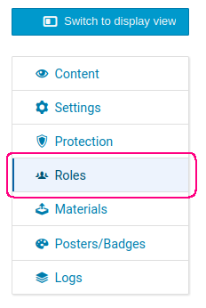
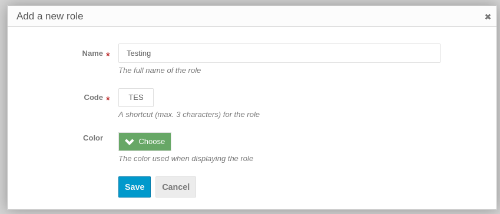
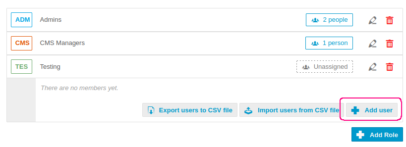
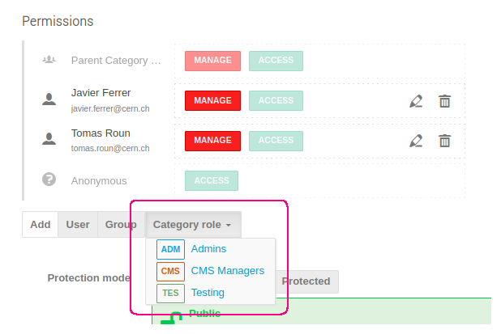

# Using custom roles

A custom role is a grouping of users to which you can assign permissions.
Using custom roles saves time e.g. when you need to modify permissions of many users. With roles, rather than modifying
permissions for every user separately, it is enough to set the permissions for the role.
Custom roles can be defined for both events and categories.

## Category roles

To create a new custom role in a category, navigate to the category management page and select _Roles_
from the sidebar.

On the right, click on _Add Role_ and in the dialog fill in the name, the code and the color. Note that these values can be changed later. Confirm by clicking _Save_.

To assign users to this new role, click on the role and then select _Add user_ in the expanded section. You also have an option to import users from a CSV file.

Having assigned users to this custom role, navigate back to the _Protection_ page.
In the _Permissions_ section, there will be an option to add a _Category role_ as shown below:

Finally, you can select a role from the dropdown and modify the permissions. These permissions will be applied to all users within the role.

## Event roles

Adding a custom role to an event is analogous to categories as shown previously. The only difference is the location of the roles page from which you can manage the custom roles.
For lectures and meetings, the page is available from the sidebar under _Advanced options_ -> _Roles Setup_. For conferences, it is located under _Organization_ -> _Roles Setup_.
