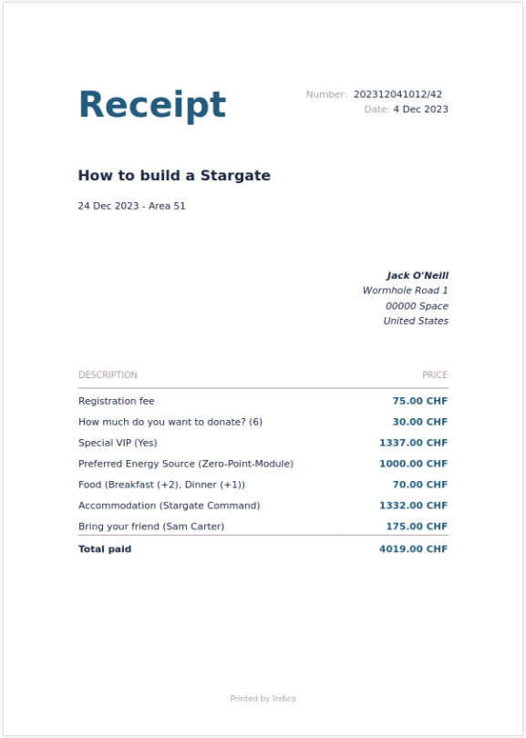

# Document Generation in Indico

Indico includes a module for generating documents, such as receipts and certificates, from templates that can be defined in the event or category. This feature is especially useful for conference organizers and administrators who need to provide attendees with customized documents quickly and efficiently.

