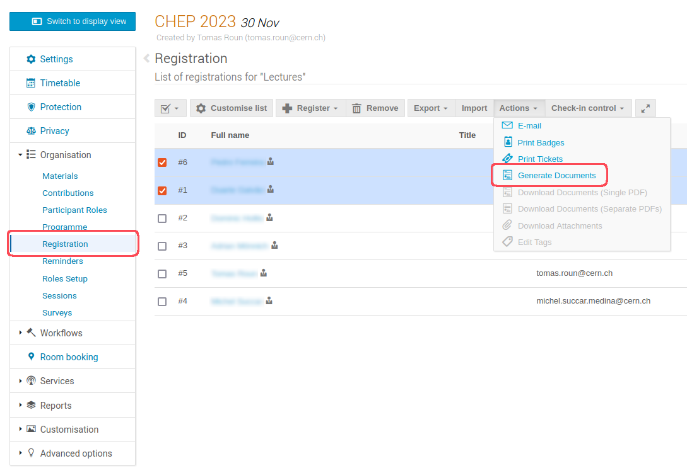
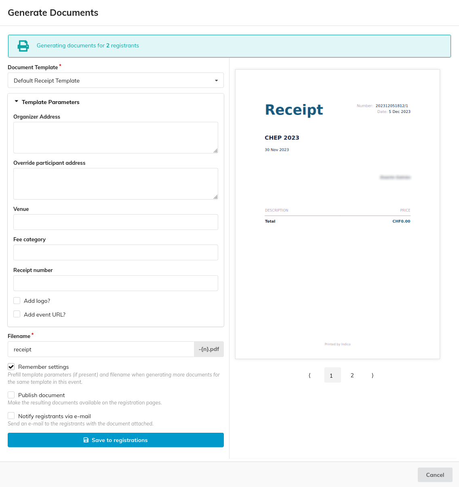

# Generating a Document

Once there are templates defined in your event, Indico can automatically populate them with dynamic data, such as attendee names, event details, and registration information. All of this can be done in bulk for a large number of registrations.

To do so, open the registrations list for your event, select the registrations for which you want to generate. Then, open the document generation dialog by clicking on _Generate Documents_ under _Actions_.

On this dialog you can select the template you want to use and set the relevant template parameters:

Additionally, you can set a filename for the generated documents. The documents will then be named using the format `<filename>-<timestamp>.pdf`. Repeated filenames will have a number appended to the end, as such: `<filename>-<timestamp>-<n>.pdf`

Moreover, you have the option to _Publish document_. If selected, the documents will be visible for the participant on their registration details page. Otherwise, they will only be visible for event managers, although they can be published individually at any moment.

There is also an option to _Notify registrants via e-mail_. If _Publish document_ is selected, it will send users an e-mail informing them of such, with a link to their registration details. Otherwise, it will send them the document directly as an attachment.

Once the documents are saved/sent, they can be downloaded in bulk as a ZIP archive, or a PDF containing all of the documents. The documents are also accessible from each registration's details page.
