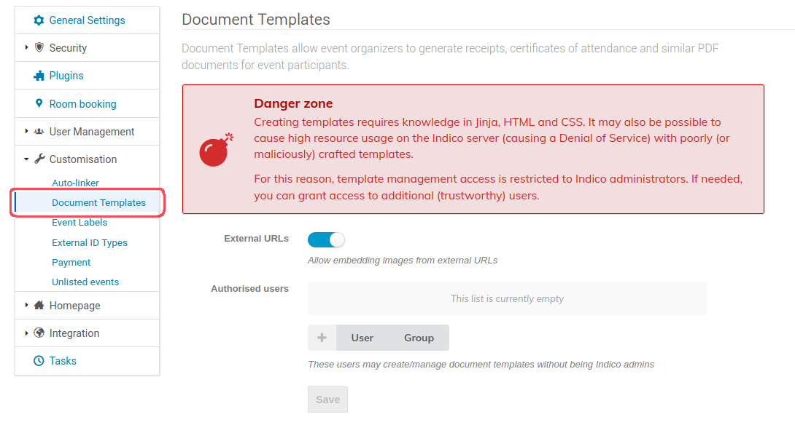
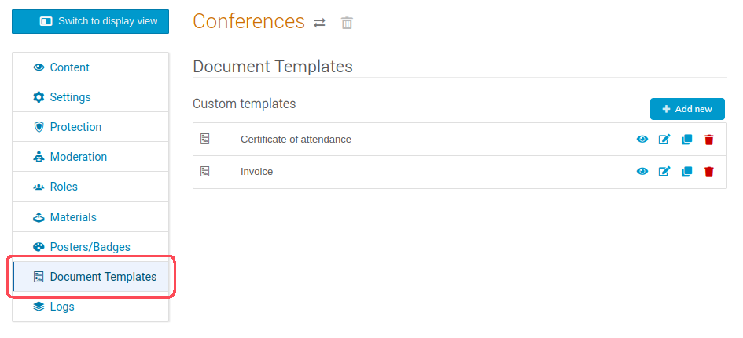
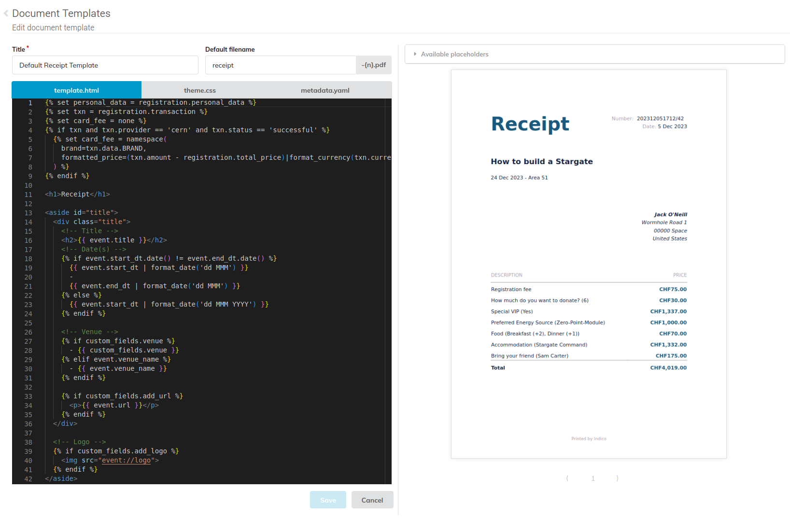

# Creating a Template

Indico lets you define templates for various types of documents, including receipts, certificates, and more. These templates allow you to specify the layout, content, and placeholders for dynamic data using HTML with Jinja2 templates.

## Configuration

Creating document templates requires knowledge of HTML and CSS and for security reasons is restricted to Indico admins. However, additional trusted users may be granted rights to create and edit templates
In the _Document Templates_ section of the Indico administration page:

## Creating a template

Templates can be either created under an event, or a category, making them available for use in all of its events. These can be viewed, added, cloned and deleted from the management area under the _Customisation_ tab in events, or in its own _Document Templates_ tab on categories.

When creating a new template you must specify its name, and optionally define a default filename. Then you can design your template using the code editor. You can write HTML with Jinja2 templates, CSS and specify custom fields in YAML.

### Defining custom fields

The custom variables are specified by defining a `custom_fields` array in the `metadata.yaml` file. For each element, you can set the following keys:

| Key | Description | Required | Type | Default | Valid values |
| --- | ----------- | -------- | ---- | ------- | ------- |
| `type` | The type of element that you want to define. | Yes | String | - | `checkbox`, `dropdown`, `input`, `textarea`. |
| `name` | The identifier for the element. | Yes | String | - | * |
| `attributes` | A set of key-value pairs that define the properties of the element.  | Yes | Map | - | - |
| `validations` | A set of key-value pairs that set constraints on the element. | No | Map | - | - |

You can choose from the following types of form elements. Each type has unique attributes and validations.

| Type | Description |
| ---- | ----------- |
| `textarea` | A multi-line text field. |
| `input` | A single-line text field. |
| `dropdown` | A dropdown menu. |
| `checkbox` | A checkbox. |

#### Attributes for `textarea` and `input`

For the value of the `attributes` key, you can set the following keys:

| Key | Description | Required | Type | Default |
| --- | ----------- | -------- | ---- | ------- |
| `label` | A brief description of the expected user input. | Yes | String | - |
| `value` | Text that is pre-filled in the text area. | No  | String | Empty string |

#### Attributes for `dropdown`

For the value of the `attributes` key, you can set the following keys:

| Key | Description | Required | Type | Default |
| --- | ----------- | -------- | ---- | ------- |
| `label` | A brief description of the expected user input. | Yes | String | - |
| `options` | An array of options the user can choose from. | Yes | String array | - |
| `default` | Index of the preselected option in the `options` array. | No | Integer | Empty |

#### Attributes for `checkbox`

For the value of the `attributes` key, you can set the following keys:

| Key | Description | Required | Type | Default |
| --- | ----------- | -------- | ---- | ------- |
| `label` | A brief description of the expected user input. | Yes | String | - |
| `value` | Text that is pre-filled in the text area. | No  | Boolean | False |

#### Validations

For the value of the `validations` key, you can set the following keys:

| Key | Description | Required | Type | Default |
| --- | ----------- | -------- | ---- | ------- |
| `required` | Prevents form submission until element is completed. | No | Boolean | False |
