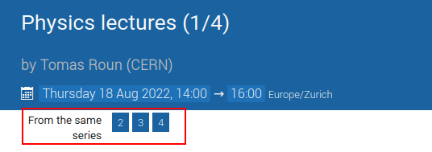
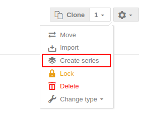
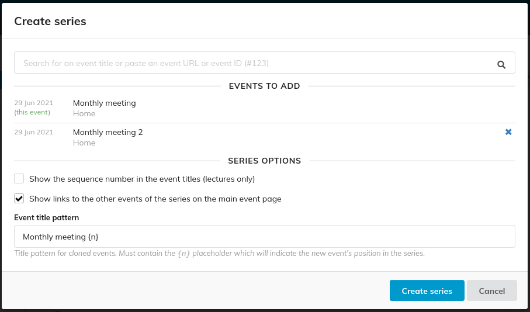
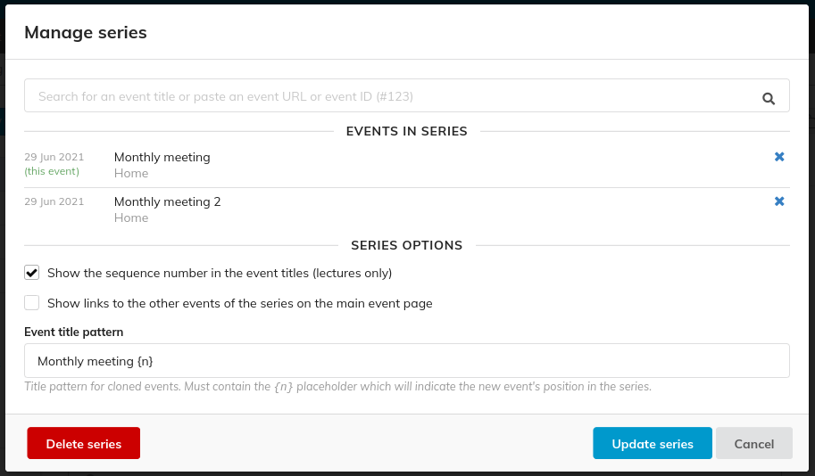
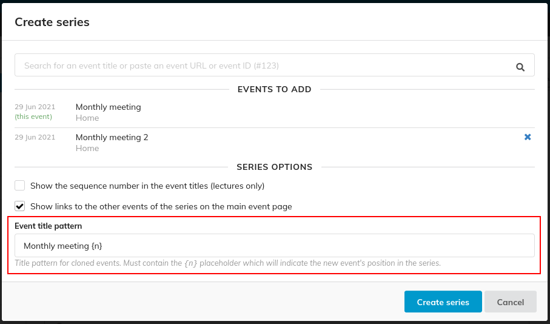
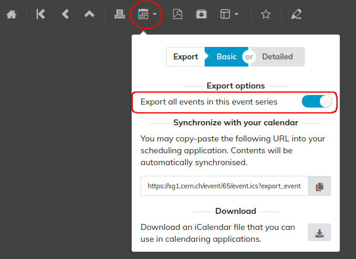

# Event Series

Indico makes it possible to link multiple events together in an _Event series_. Events in a series can display links to other events in the series on their main page:

### Creating an event series

Lecture series can be created directly by adding an [_occurrence_](../lectures/creating) in the creation dialog, but it is possible to create an event series from **any** events.

To create a series from existing events, select one of the events and navigate to the management area. From the event actions in the top right corner, choose _Create series_.

This will open a dialog where you can search for events to be added to your series:

### Editing a series

To modify an existing series, simply open the dialog again, make your changes and confirm by clicking _Edit series_. The same dialog also lets you delete the series itself, which unlinks all the events in it. This also removes the links to other events on the event page.

### Cloning events in a series

Event cloning is aware of your event series and will automatically add cloned events to the event series. It is also possible to set an _Event title pattern_ in the settings page which will be used to generate the event title of the cloned event. The title needs to use a placeholder `{n}` which will be substituted for the position of the event in the series. For example, if the title pattern is `Monthly meeting {n}` the title will become _Monthly meeting 3_ if the cloned event is the third event in the series (cloned events are added to the end of a series).

### Exporting a series to a calendar

Indico already allows you to synchronize events and categories with external calendar applications.
If you instead wish to synchronize all events in an event series, first navigate to any event in the event series you want to synchronize.
In the top left, click on _Export_ and in the popup enable _Export all events in this event series_ under _Export options_. Now both the URL and the downloaded ical file will include all events in the series. If you use the URL, new events added to the series will be automatically added to you calendar.

