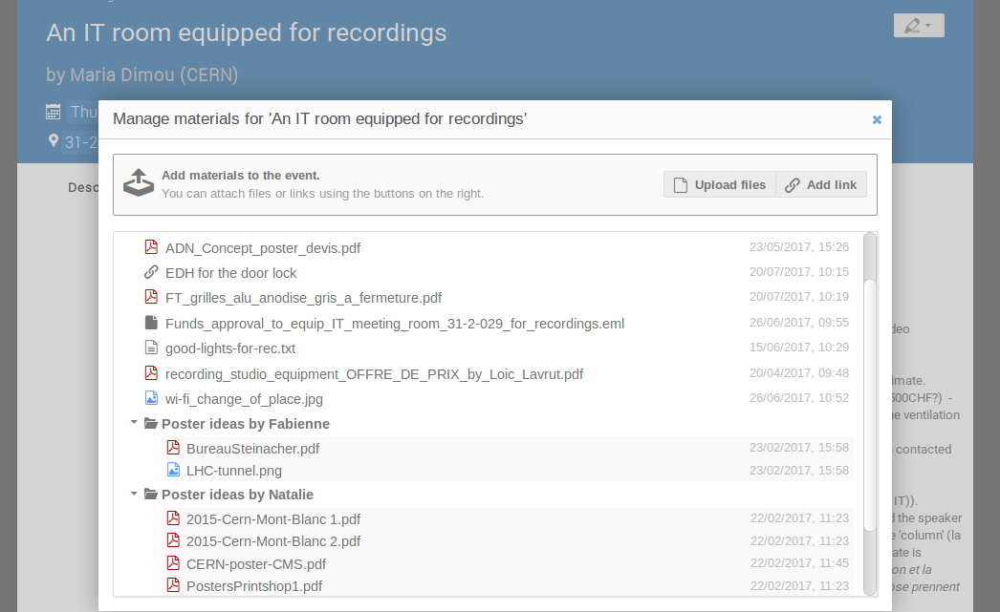

# Adding Material to a Meeting

Click on the pencil at the top right of your screen, and click on _Material Editor_.

In this window, you can _Upload files_, _Add links_, or create a new **folder** in which you will include your files.

For example, to upload a file, simply click on _Upload files_, click on _Choose from your computer_ and select a file from your device. You can also drag and drop your file in the area indicated.
Here you can also choose to automatically convert your file to PDF, and decide whether you want your file to be accessible to anybody or to a selected few.

Once you’re finished, click on _Upload_ and close your window.

See an example of a meeting with material directly attached to the event as well as included in _Folders_.

