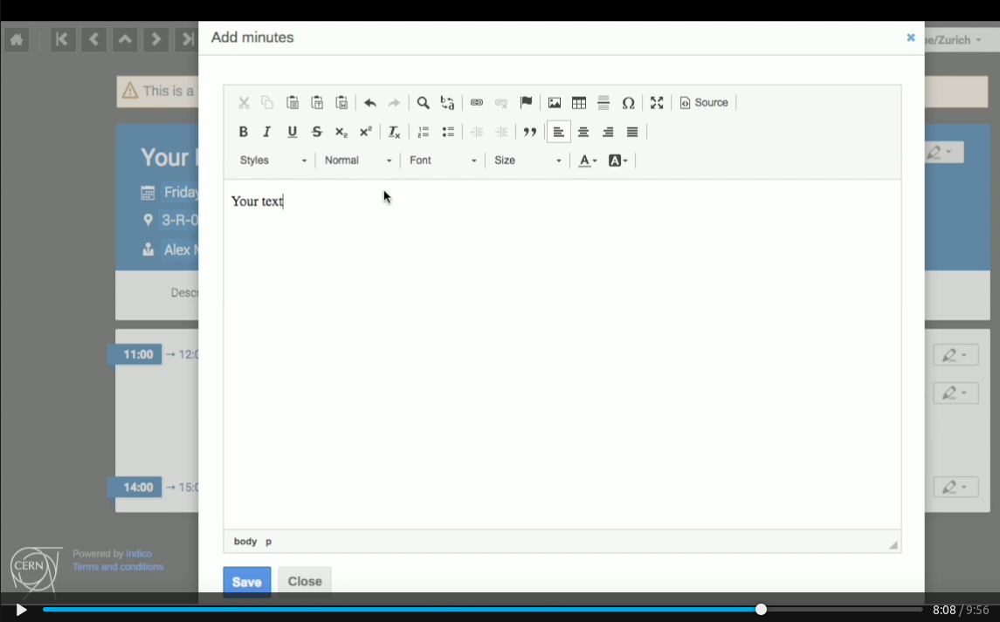
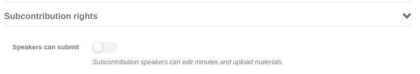

# Adding Minutes to a Meeting

To add minutes to the whole event, click on the pencil on the top right of the page, and click on _add minutes_.
Here you can add the text of the minutes of your meeting, you are offered formatting help (headers, bulleted or numbered lists, etc.).
Click on save, and then on Close.

Minutes can also be added to your session or contribution, by clicking on the relevant pencil on the right.

See an example on the image below where _Description_, _Minutes_ and _Material_ exist at the level of the Event as well as at the level of individual _Contributions_.

If you make use of subcontributions in your meetings, you may consider giving submitter rights to the subcontribution speakers. This allows the speakers to upload their own minutes and materials in the subcontribution without having submitter rights in the parent contribution.

This setting is available on the _Protection_ page under _Subcontribution rights_:

