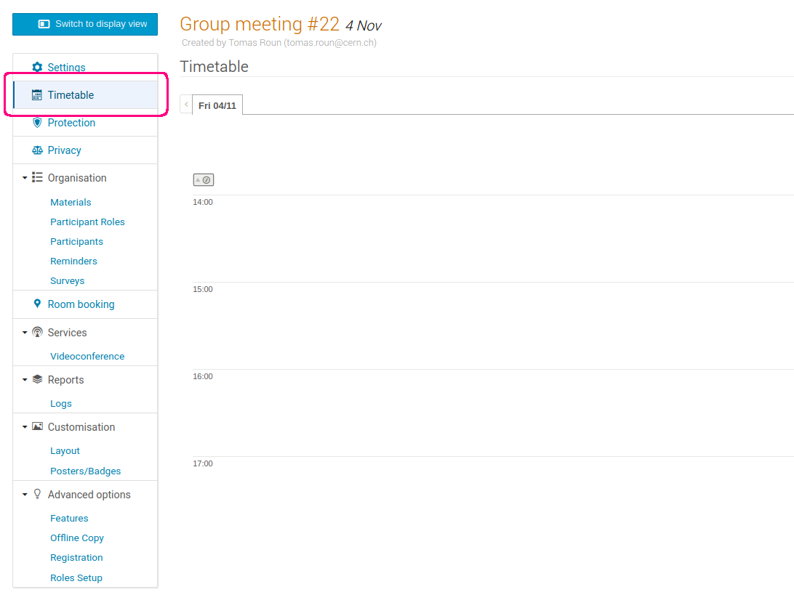
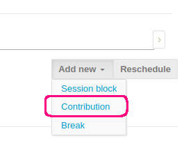
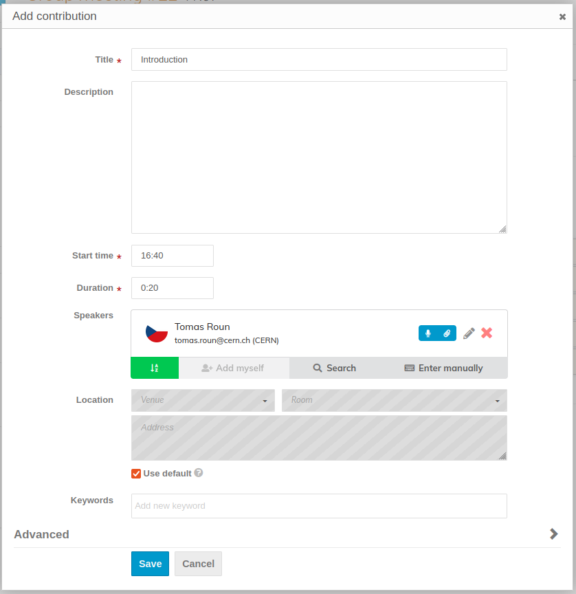
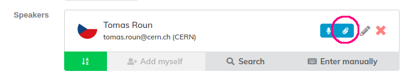

This part will quick-start you on creating your first meeting timetable. We will cover the most basic actions and settings in order to get a basic meeting timetable up and running. If you want to learn about all the possible options and features, we suggest going through a more comprehensive tutorial that can be found in the section about conferences [here](../conferences/timetable.md).

### A basic meeting timetable

A typical meeting timetable might look something like this:

Each one of the timetable entries is a so-called contribution. A contribution is the most basic element of a timetable. It can be thought of as a talk or a discussion item with one or more speakers. Even though meetings are often made up of only contributions, it is possible to add other entries like breaks and session blocks (covered in detail [here](../conferences/timetable.md)).

### Contributions

To schedule a contribution, first navigate to _Timetable_ in the management area of your event. This opens the top-level view of the timetable, which is currently empty:

To create a new contribution, click on _Add new_ in the top right corner and select _Contribution_ from the dropdown menu.

A new dialogue window will open where you must fill at least the title, start time and the duration of the contribution. You can add speakers in the _People_ field. Speakers will be displayed under the contribution in the timetable.

If you want to allow the speakers to [add minutes](./minutes.md) or [upload files](./material.md), make sure the _Submitter_ permission is switched on:

When you are done filling in the data, click _Save_ to schedule the contribution. Once created, you can drag the contribution up down in the timetable to change its start time.

You can repeat this step to create a contribution for every discussion item in your meeting. To learn more about the timetable, you can continue reading [here](../conferences/timetable.md).

