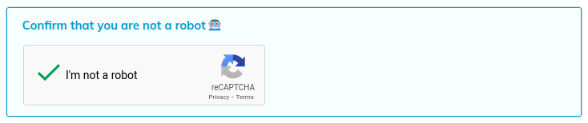
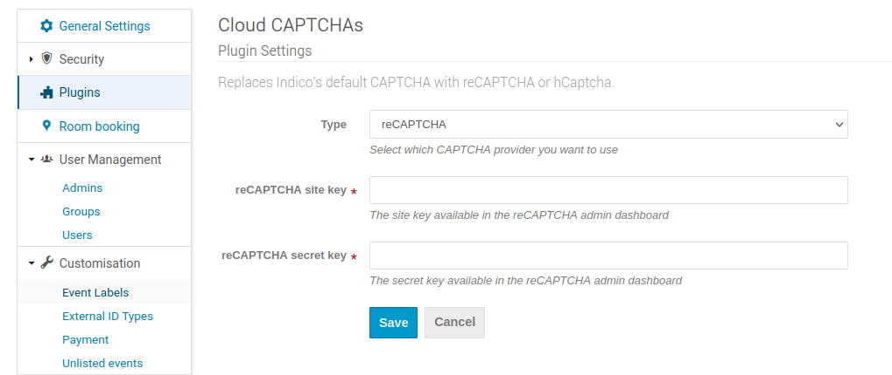

# Cloud CAPTCHA support

Indico comes with a CAPTCHA support out-of-the-box. It secures both the signup page and public event registrations. In addition, two cloud CAPTCHA solutions - Google's reCAPTCHAv2 and hCAPTCHA - are available to use as an optional [plugin](https://pypi.org/project/indico-plugin-cloud-captchas/).

Once installed, you can select which type of CAPTCHA you want to use. Additionally, you might need to provide some information in order to enable the CAPTCHA.

