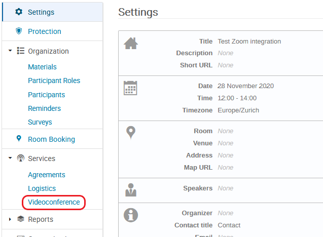
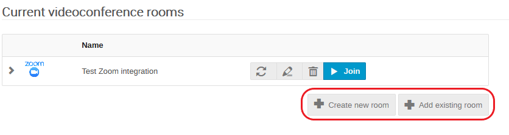
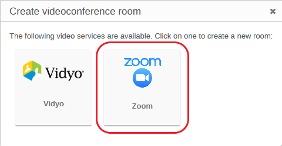
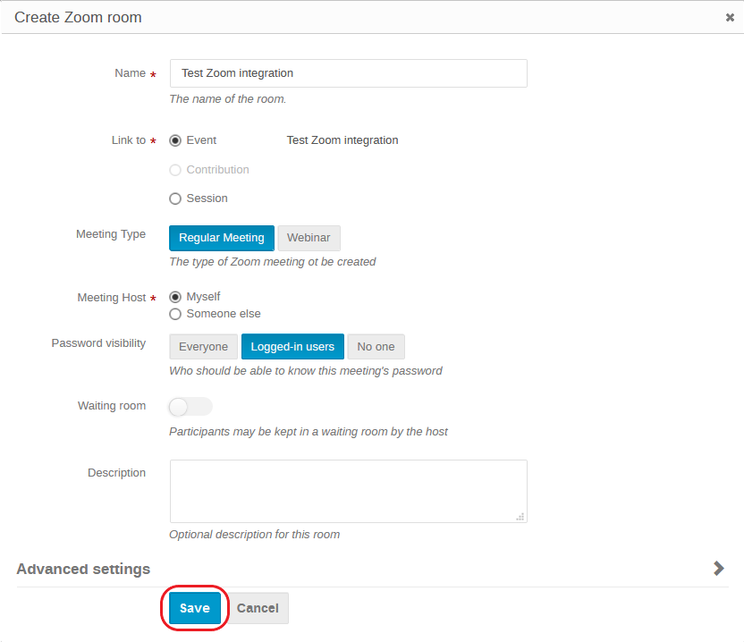
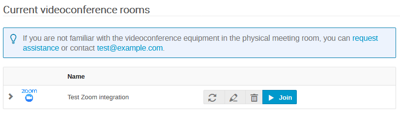

# Zoom Integration

!!! warning
    This feature is only available in servers where the
    [Zoom Plugin](https://github.com/indico/indico-plugins/tree/master/vc_zoom) is installed.

Indico allows meeting organisers to create a Zoom meeting and manage it directly from the management area of their
event. Once created, the connection information of the Zoom meeting is displayed to the participants of the meeting,
and additional buttons are added to the interface letting participants to easily connect to the Zoom meeting, and
organisers to connect their physical meeting room to the Zoom meeting.

## Managing Zoom Meetings

On the management page of your Indico event click on _Videoconference_ under the tab _Services_ on the left banner.

Here you can _create_ a new Zoom meeting or _Add_ an existing one to your event.

Simply click on one option then select the Zoom videoconference service.

### Adding an existing Zoom meeting

If you just need to **Add an existing room**, start typing the name of the meeting. A list of existing Zoom meetings
will be suggested. **Select** the one you need and click on **Save**.

Going back to the _Event display view_ you will see that the meeting is now attached to your event.

You have the possibility to set a Zoom meeting only for a *part* of your event, by linking it to specific
contributions or sessions only.

### Creating a new Zoom meeting

If you choose **Create a new room**, you'll see the name of your event is copied, by default, to the Zoom meeting's
name. You can change it to something more generic, for instance to re-use in the future, if you want.

The other fields may be left as they are, but you may be interested in tuning some of them:

* You can use the **Description** field to write something helpful for your users who will be joining in the
   future;

* The default **Host** of the Zoom meeting is you, but you can **choose** someone else, who will become the host of
  the meeting.

!!! warning
    Please remember that in Zoom the same host cannot start several meetings in parallel !

* You may also assign a **Passcode** to your meeting, if you wish. Only people who have the passcode will be able
  to join your meeting. You can decide whether the passcode should be displayed **in the clear** on the Indico page
  for everyone or only for **logged in users (recommended)**, or for **no one at all** (e.g. you're sending the
  passcode via e-mail).

* The **Advanced Settings** allow you to choose if the Zoom meeting should be displayed on the event page, as well
  as various **mute** options which will be applied when someone joins it.

Click on **Save**.

Check your videoconference room list, see how you can **Edit** your room, **Detach** it from the event or **Join**
it with a single click:

Click on **Join** and you will be directed to a Zoom meeting page. You will then have the choice to join using the
desktop Zoom client or its web-based version.
