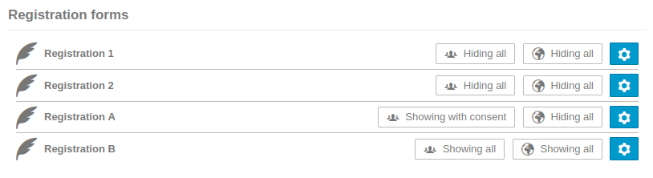
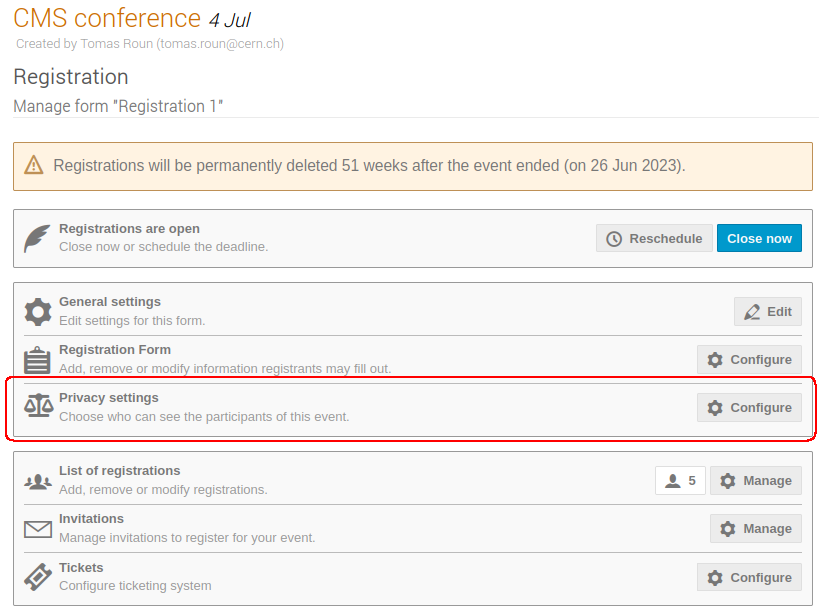
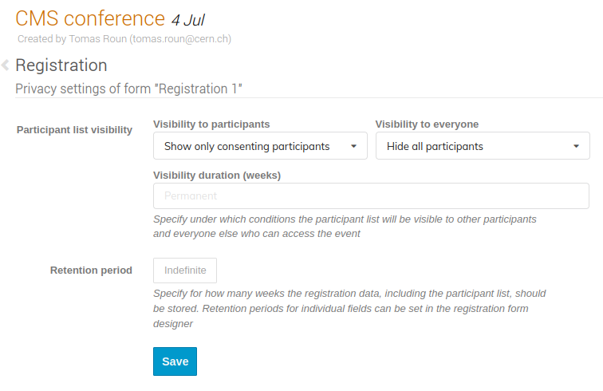
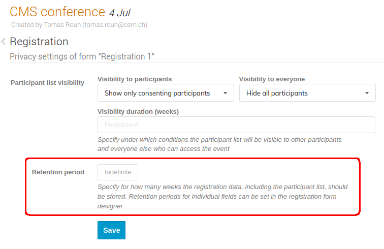
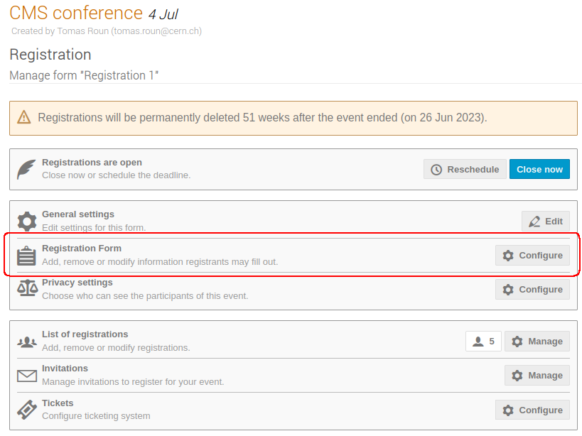

# Privacy

Indico includes a number of privacy features to help you manage your participants' registration data and to keep the participants informed about how their personal data is handled.

### Managing event privacy settings
The event privacy settings are accessible from the management area in a separate tab called _Privacy_.
From here, you can manage all privacy related settings of your event.

#### Data controller
The first section of the privacy dashboard specifies the _Data controller_.

If in your event you collect personal data and are subject to GDPR or a similar data privacy legislature,
you may specify the name and contact information
of your designated Data controller here.

#### Privacy notice
In the following section, you can set a privacy notice for your event.
You may choose between linking to an external page containing the privacy notice or
entering a privacy notice in the text field.

If needed, you can also specify multiple
external notices by clicking the *Add* button and adding a title and the external url.

The privacy information is accessible to participants in both meetings and conferences.
For meetings, the privacy information is available from a popup in the top right corner of the event header, while for conferences there is a new menu entry with a separate page.

### Participant visibility
By default, Indico displays all registered participants on the event page.
However, some participants may prefer that this information not be visible to everyone.

To this end, Indico allows you to set the participant visibility settings for every registration form in your event.
The visibility settings can be adjusted separately for registered participants and the general public.

The visibility options are:

- Hidden

- Visible if the participant gives consent

- Always visible regardless of consent

When registering, participants are presented with an option to agree to being shown in the participant list. This corresponds to the second option from the list above.

The last option which makes the participant always visible is discouraged and should not be used unless there is a legitimate interest to have the participant list visible. Moreover, this option can only be selected as long as there are no registered participants.

The last section of the privacy dashboard shows the current visibility settings for all registration forms in the given event.

The visibility settings can be managed by clicking on the cog icon corresponding to the registration form
you wish to update. This opens the registration privacy settings which can also be reached by going to the registration form settings and selecting _Privacy settings_.

On this page you can change the participant visibility settings and the visibility duration, which when set
will automatically hide the participant list after a given number of months. 

### Data retention period
Indico allows you to automatically delete registration data after a set amount of time by setting a retention period.

A retention period can be set registration-wide which then applies to the whole registration form. Once this period expires, 
all registrations are automatically deleted along with any data, including the participant list.

In conjuction, it is also possible to set a retention period for individual registration fields. This granularity is useful in case some fields need to be kept while others can be deleted. Once the retention period expires, only the data of the field where the retention period was set is deleted.

The retention period is counted relative to the end date of the event.

The registration-wide retention period can be set on the registration privacy settings page just under the visibility settings:

To set a retention period on a registration field, first open the registration form designer by going to _Registration_ -> _Manage_ -> _Registration Form_.

Then, open the field settings by clicking on the cog icon next to the field you want to edit.

You can set the retention period at the bottom of the settings dialog:

Additionally, fields which have a retention period will display a clock icon next to their name.

