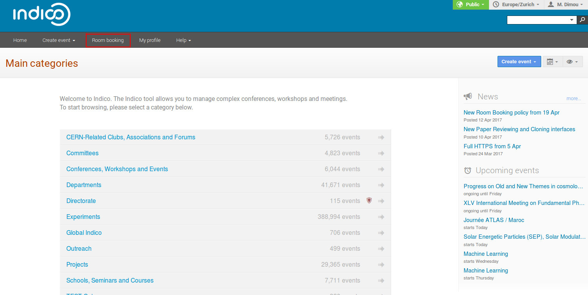

# Accessing the module

## Getting into Room Booking Module

Just click on _Room Booking_ in the Indico home page, in the top dark bar. You will be asked to sign in. Use your Indico login.

### The First Page

The Room Booking first page shows a booking area, a side menu and a horizontal menu.

#### The booking area

#### The horizontal menu

##### Book a Room

This is the main page of Indico Room Booking and the page to go if you want to book a room easily.

##### List of Rooms

This page shows you all the rooms available at CERN for your conference, meeting or lecture. You also have a map if you want to find a room in a specific area of CERN.

##### Bookings

This page shows you the bookings for all the rooms by day, by week and by month.

#### The side menu

---
