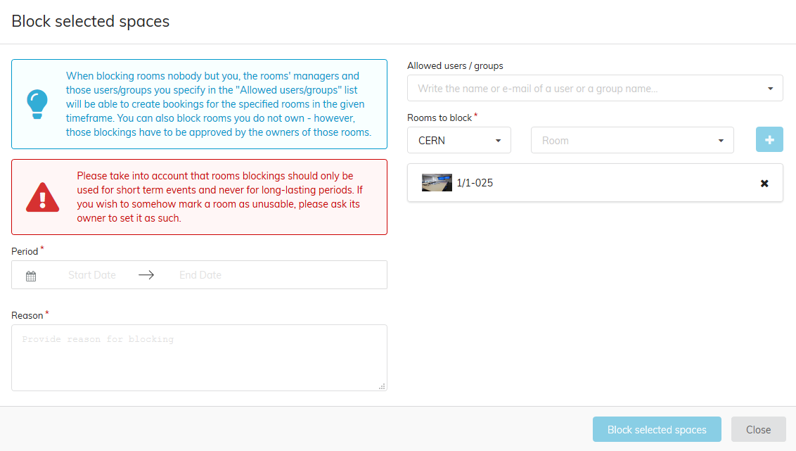

# Blocking Rooms

## Block a room

As a room manager you may create room blockings which prevent regular users from booking certain rooms. This feature can be used for special events during which only a few people should be allowed to create bookings for some rooms. If you are not a manager, you ca also block rooms. However, those blockings have to be approved by the owners of those rooms.

To create such a blocking, go to List of Rooms in the Room Booking horizontal menu and follow these steps:

* Choose the period during which the rooms should be blocked by clicking the start and end date on the calendars.
* Enter a reason for the blocking - it will be displayed to users trying to book one of the blocked rooms.
* Add some rooms to the Rooms list. Those will be affected by the blocking.
* Unless you want to be the only one to be able to book the blocked rooms, you can add other users or groups to the Allowed users/groups list.
* Submit the blocking after confirming that the chosen period is correct. Once you have created the blocking, the dates cannot be changed.

---
