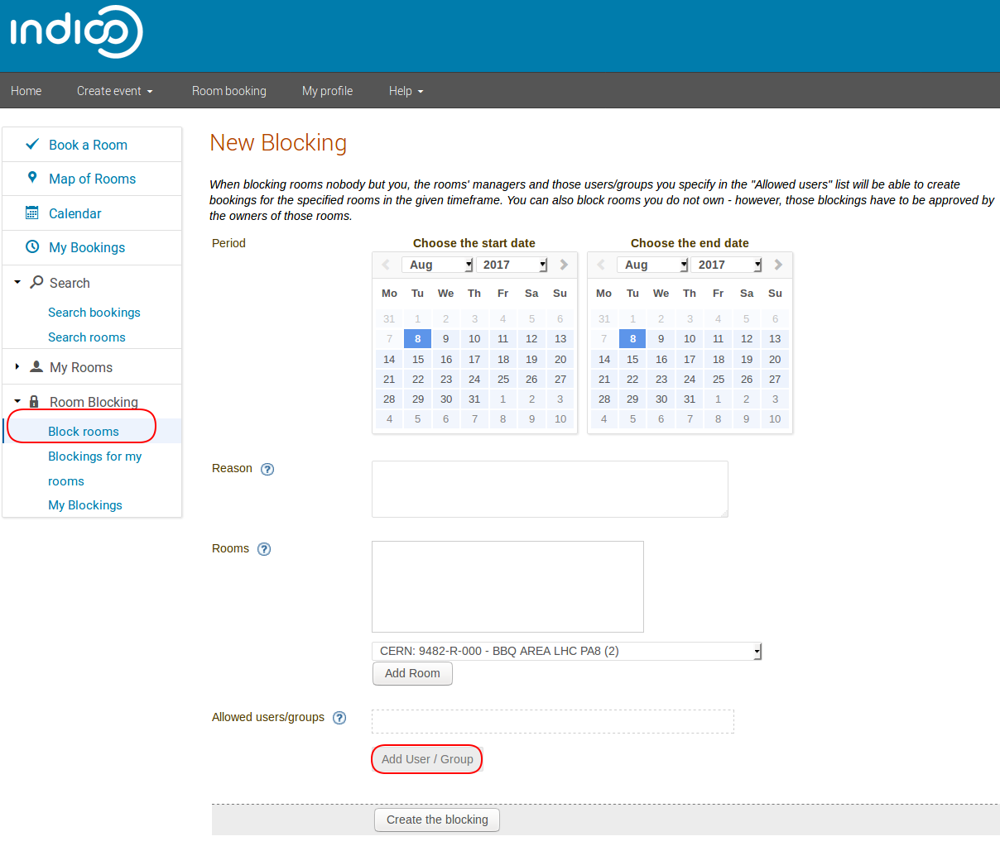

## Block a Room

As a room manager you may create room blockings which prevent regular users from booking certain rooms. This feature can be used for special events during which only a few people should be allowed to create bookings for some rooms.

To create such a blocking, go to _Block rooms_ in the Room Booking side menu and follow these steps:

* Choose the period during which the rooms should be blocked by clicking the start and end date on the calendars.
* Enter a reason for the blocking - it will be displayed to users trying to book one of the blocked rooms.
* Add some rooms to the _Rooms_ list. Those will be affected by the blocking.
* Unless you want to be the only one to be able to book the blocked rooms, you can add other users or groups to the _Allowed users/groups_ list.
* Submit the blocking after confirming that the chosen period is correct. Once you have created the blocking, the dates cannot be changed.

When trying to book a blocked room, users in the _Allowed users/groups_ list will see that the room is blocked and the reason why but will be able to create bookings anyway. You as the creator of the blocking will always be able to override your blocking, so you don't have to add yourself to the list. The same applies to the owners of blocked rooms. They will see the blocking and a warning that the room has been blocked, but they are able to override the blocking.

You can also create blockings for rooms you don't own. These blockings will have to be approved be the respective owners - until they do so, other users trying to create a booking on that room will see the pending blocking request but will be able to carry on with their booking.

As soon as the blocking for a room has been approved \(blockings for your own rooms are immediately approved when creating the blocking\), all bookings colliding with the blocking are automatically rejected.

