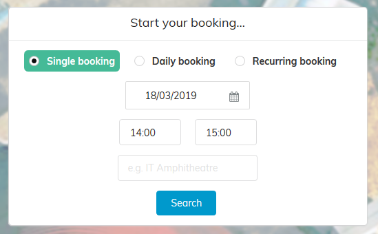
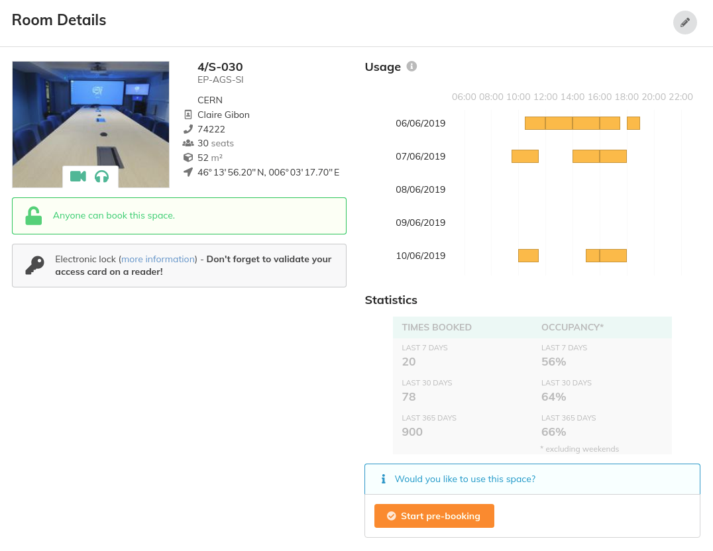
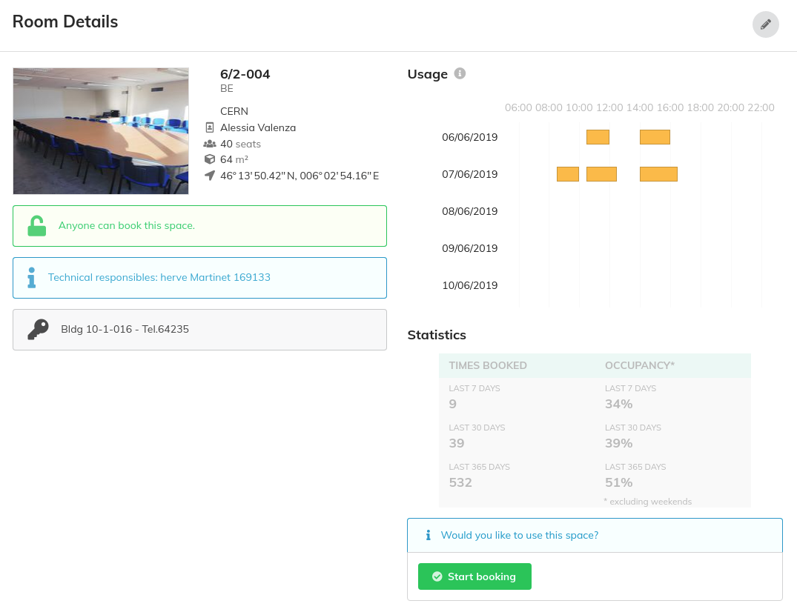

# Book a Room

As a first step click on the button *Book a Room* in the horizontal menu. In the booking area you have to specify the kind of booking, date range and time range in which you want to search for bookings. You can also search by building number or room name if you want  to find a specific room in a specific location.

If you want to book the room for only one day, simply click on *Single booking* and on the date you want by choosing the correct month and day. You will also have to choose the time interval you want to book it for.

If instead you want to book a room for several consecutive days, weeks, or months, click on *Daily* or *Recurring booking*

If you have already used Indico Room Booking and have selected favourite rooms, your booking area will look like this picture. If you want to book only a room from your favourites check the box *search only my favourites*. To know how to add a favourite read the section below.

Then you will be directed in a page with all the Rooms available according to your request.

You can use some filters if you want your room to contain certain equipment, such as videoconference, Webcast or a Projector.

To *pre-book a room, book a room, view room details* or *add a room to your favourites* put your mouse over the picture of a room and make your choice.

If you select **book a room** you will see this window:

There, you may find information about the room such as capacity and size of the room. To finalise the booking, you have to fill in the *Usage* section mentioning the person for whom you are making the booking and giving the reasons why you book this room.

## How to pre-book a room

Some rooms require owner's approval. Therefore they can only be pre-booked. If you select **pre-book a room** you will see this window:

There, you may find information about the room such as capacity and size of the room. To finalise the pre-booking, you have to fill in the *Usage* section mentioning the person for whom you are making the pre-booking and giving the reasons why you pre-book this room.

## How to see room details

If you select **room details** you will see one of these windows:

In this window, you may find information such as size,   capacity and phone number in the room. If you click on the button *book it*, you will be directed to the *book a room* or *pre-book a room* window. To know how to finalise a pre-bookig or booking, read the previous paragraphs.

If you select **add to favourites** the room will be placed in your favourites' list. For your next booking, you could find all your favourite rooms by selecting this option in the filters' menu or ticking the box *search only my favourites* in the booking area of the first page.

---

