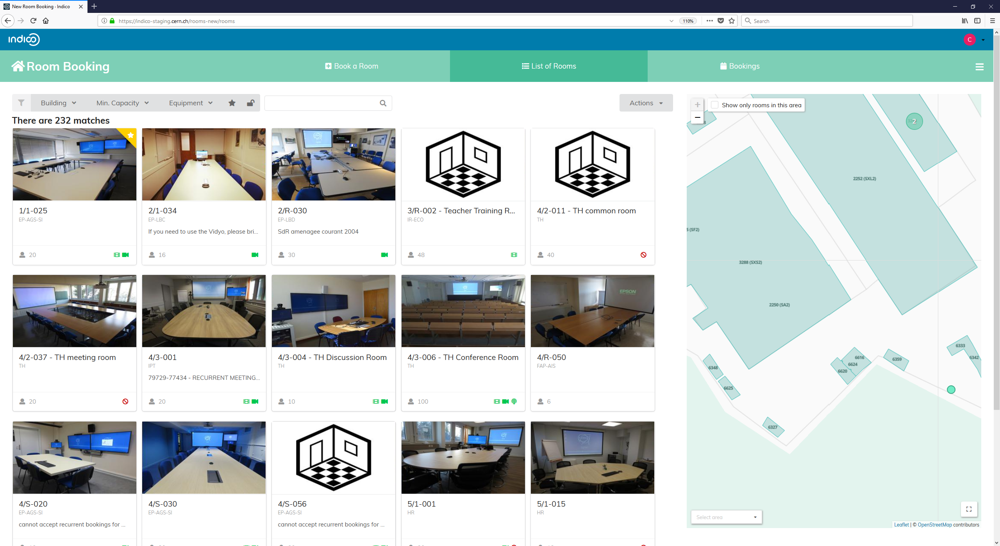
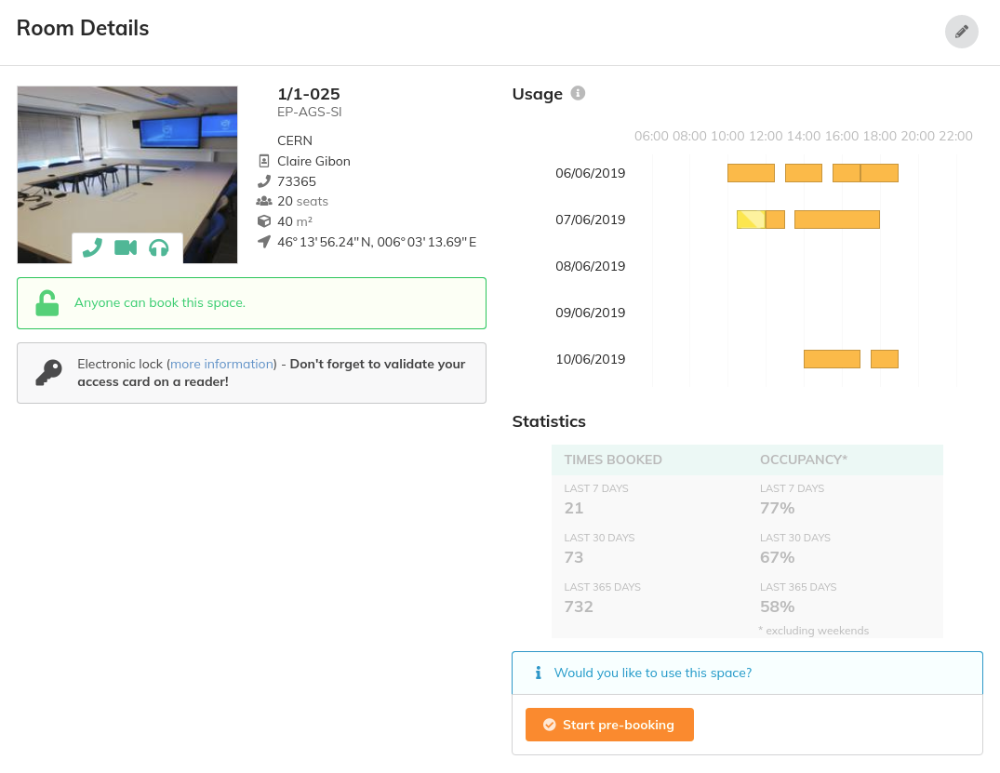
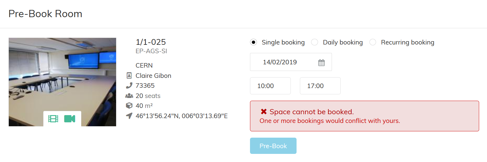

# Searching and Booking

Let’s now look at how to search for an available room based on more specific criteria.
For this, click on *List of Rooms* in the horizontal menu.

At the top of the page, there are some criteria you can select to filter the rooms:

Choose the building you want and the number of seats you want the room to have. Then select the criteria that you want from the extensive list of equipment. Every time you select a criteria do not forget to click on *apply* or your criteria will not be taken into consideration.

If you want to see only the rooms you are authorised to book or your favourite click on *Show only* and select your criteria.

Once you have finished, the next page will show you the list of rooms that match your criteria.

Place your mouse over the picture of the room which interests you and click on *see details* for more details about the room.

There you can also start booking or pre-booking (if the room requires confirmation) and you will be directed to the page that allows you to book the room. Complete just like we have seen before.

## Booking conflicts

After your search, if you choose a room which is already booked you will see a window with an error message and you will not be able to make your booking. To solve this problem, you have two options:

1. Go to the previous page and choose another room according to your criteria.
2. Change the date or/and hours for your booking.

If you are making a daily booking and the room you choose is not available for one or more days you will see a warning message:

If you decide to book this room anyway, you will be directed to the pre-booking/booking page. You will see another warning message telling you the number of your occurrences which are in conflict with existing bookings. To finalise your pre-booking/booking you will have to check the box **"I understand, please skip any days with conflicting occurrences"**. It means that you will have to find another room for the days in conflict.

---
