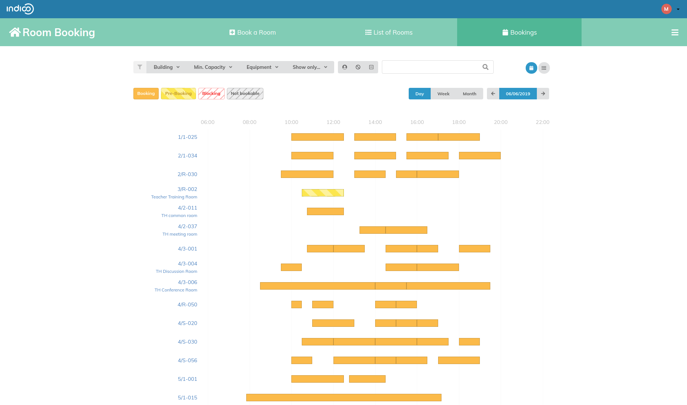

# Viewing your Bookings and all the bookings

## Your Bookings

You can view the bookings or pre-bookings that you made by going under the *My bookings* section of the Room Booking side menu.

## All the bookings

You can view all the bookings made by everybody for all the rooms clicking in *Bookings* in the horizontal menu.

At the top of the page, there are some criteria you can select to filter the rooms:

Choose the building you want and the number of seats you want the room to have. Then select the criteria that you want from the extensive list of equipment. Every time you select a criteria do not forget to click on *apply* or your criteria will not be taken into consideration.

If you want to see only the rooms you are authorised to book or your favourite click on *Show only* and select your criteria.

Once you have finished, the next page will show you the list of rooms that match your criteria.

This option can help you to do a last minute room booking or to solve a booking conflict. You can see easily the name of the colleagues who booked the rooms and email them to try to find a solution for the conflict if you really need this room and no one else can correspond to your criteria.

---
